# Neuron OS

*The Operating System for Autonomous AI Agents*

[]()
[]()
[]()
[]()
[]()
[](./LICENSE)
[](https://github.com/KunjShah95/neuron-os)

---

> **Neuron OS** is a local-first, TypeScript-native operating system for autonomous AI agents. Spawn typed agents, watch them work in real-time across terminal/web/chat/API surfaces, and trust every action through built-in audit logging, per-agent tool policies, and cost attribution.

## Quick Start

**Zero install — three ways to start:**

**1. CURL** (Linux/macOS — downloads prebuilt binary)
```bash
curl -fsSL https://raw.githubusercontent.com/KunjShah95/neuron-os/main/install.sh | bash
```

**2. NPX** (cross-platform — auto-downloads shim)
```bash
npx neuron-aegis                  # interactive mode picker
npx neuron-aegis status           # system overview
npx neuron-aegis chat             # streaming AI chat
npx neuron-aegis dashboard        # live agent monitoring TUI
npx neuron-aegis serve            # start REST API server
```
The shim downloads the prebuilt binary on first run and caches it at `~/.aegis/bin/`.
If you have [Bun](https://bun.sh) installed, `bunx neuron-aegis` skips the download and runs TypeScript directly.

**3. Docker** (containerized)
```bash
docker run -d --name aegis -p 8080:8080 ghcr.io/kunjshah95/neuron-os:latest
```

**Windows (PowerShell):**
```powershell
irm https://raw.githubusercontent.com/KunjShah95/neuron-os/main/install.ps1 | iex
```

**Or install from source** (for development):

```bash
git clone https://github.com/KunjShah95/neuron-os.git
cd neuron-os
bun install

bun run index.ts                   # interactive mode picker
bun run index.ts dashboard         # Live agent monitoring TUI
bun run index.ts chat              # Streaming AI chat
bun run index.ts status            # System overview
bun run index.ts serve             # Start REST API server
```

**Prerequisites:** [Bun](https://bun.sh) >= 1.3.14 (only needed for source install — the curl/npx methods don't require it)

---

## What's in the Box

### TUI Modes (36)

Run `aegis` (no args) for the interactive mode picker, or launch directly:

| Mode | Command | Description |
|------|---------|-------------|
| Mode Launcher | `aegis` / `wakeup` | Interactive mode selector |
| Dashboard | `dashboard` | Real-time agent monitoring TUI |
| Chat | `chat` | Streaming AI chat with multi-provider support |
| Status | `status` | System health overview |
| Skills | `skills` | Browse and manage skills |
| Config | `config` | Credential vault and settings |
| Cron | `cron` | Scheduled job management |
| Memory | `memory` | Long-term memory, vector search, knowledge graph |
| AgentMemory | `agentmemory` | Hybrid BM25+Vector+Graph sidecar |
| Agent Manager | `agent` | Spawn, kill, inspect agents |
| Setup | `setup` | Interactive configuration wizard |
| API Server | `serve` | HTTP REST API + WebSocket |
| MCP | `mcp` | Model Context Protocol client/server |
| Cost | `cost` | Per-task, per-agent cost attribution |
| Router | `router` | Auto-select cheapest provider per task |
| Estimate | `estimate` | Pre-flight cost check before spawning |
| Insights | `insights` | Cross-DB analytics across all stores |
| Benchmark | `benchmark` | Agent quality regression detection |
| Bench | `bench` | Provider benchmark comparison |
| Improve | `improve` | Self-learning: skill extraction, failure clustering |
| Production | `production` | RBAC, vault, SLO, traces, background agents |
| Distributed | `distributed` | Multi-host worker pool, leader election |
| **Plugin** | `plugin` | **Install, publish, and manage signed plugins** |
| **Dream** | `dream` | **6-phase dream cycle: replay, pattern, compress** |
| **Evolve** | `evolve` | **Auto-code mutation with test verification** |
| **Persona** | `persona` | **Agent trait evolution from experience** |
| **Social** | `social` | **Multi-instance gossip & peer discovery** |
| **Eval** | `eval` | **Harness: run, CI gate, calibrate, golden dataset** |
| **Mesh** | `mesh` | **Multi-agent orchestration (5 topologies)** |
| **Train** | `train` | **Trajectory recording & export** |
| **Toolset** | `toolset` | **Manage and compose tool bundles** |
| **Project** | `project` | **Isolated workspaces with per-project state** |
| **Voice** | `voice` | **Voice system configuration and control** |
| **Soul** | `soul` | **Agent soul cards & mood system** |

### Web Frontends

| Directory | Purpose | Stack |
|-----------|---------|-------|
| [`website/`](website/) | Public marketing site | Vite + React 19 + Framer Motion 12 + Tailwind 3 |
| [`dashboard/`](dashboard/) | Web app (Console, Chat, Agents, Docs, etc.) | Vite + React 19 + React Router 7 + Tailwind 3 |

```bash
cd website && bun install && bun run dev    # :5173
cd dashboard && bun install && bun run dev  # :5173, proxies /api to :8080
```

### Agent System (14 Types)

Spawn typed agents with scoped tools, auto-recovery, and lifecycle hooks:

| Type | Mode | Tools | Description |
|------|------|-------|-------------|
| `build` | primary | all | Full-access development agent |
| `plan` | primary | read-only | Architecture and planning |
| `main` | primary | read, web, bash | Default agent type |
| `read` | subagent | read-only | Fast codebase exploration |
| `write` | subagent | write/edit/read | File creation and editing |
| `test` | subagent | bash (restricted), read | Test execution |
| `validate` | subagent | read, bash (lint) | Type checking and linting |
| `review` | subagent | read-only | Code review (security, patterns) |
| `debug` | subagent | all | Systematic debugging |
| `document` | subagent | read, write | Documentation generation |
| `refactor` | subagent | read, write, edit | Code restructuring |
| `deploy` | subagent | bash (deploy), read | Deployment and CI/CD |
| `monitor` | subagent | bash, read | File watching and health checks |
| `explore` | subagent | read-only | Lightweight search |

### Soul & Emotion System

Every agent gets a **soul** — an archetype-driven emotional model that shapes communication and behavior:

- **8 Archetypes:** Architect, Craftsman, Sage, Scout, Guardian, Alchemist, Oracle, Weaver
- **6 Mood States:** elated, confident, content, anxious, frustrated, burned_out — triggered by outcome streaks
- **Soul Cards:** ASCII art trait display with progress bars, injected into agent system prompts
- **Behavioral Heuristics:** Mood overrides verbosity, tone, formality, and emoji usage at runtime
- **Automatic:** SoulManager auto-creates souls on spawn, records outcomes on exit

### Multi-Platform Gateway (11 Adapters)

One interface, eleven chat platforms. All behind `src/adapters/gateway.ts`:

- Discord bot (Socket Mode)
- Slack bot (Socket Mode)
- Telegram bot
- SMS (Twilio)
- Voice calls (Twilio)
- WhatsApp (Twilio)
- Email (SMTP/Nodemailer)
- Webhook (generic + GitHub)
- Matrix (matrix-js-sdk)
- Signal (signal-cli REST API)
- IRC (irc-framework)

### WebSocket Gateway

Bun-native WebSocket server on port 8081 with multi-user channels, token-based auth, and real-time state streaming — built for live dashboards and collaborative agent monitoring.

### AI Providers (13)

Anthropic, OpenAI, DeepSeek, Groq, Gemini, Mistral, Azure OpenAI, Together AI, Ollama (local), OpenRouter, xAI, Cohere, Perplexity — plus custom endpoints. Auto-routed by cost with `aegis router route`. Switch at runtime in chat TUI with `/provider set <name>`.

### Project Workspaces

Isolate everything per project — sessions, memory, dreams, evolutions, personas, social data. Each project lives in its own `~/.aegis/projects/<name>/` directory. Switch with `aegis project switch`.

### Toolset System

Compose tool bundles from 10 built-in toolsets (web, search, vision, code-execution, delegation, file-ops, shell, research, full-stack, all) with transitive dependency resolution. Create custom toolsets with `aegis toolset new`.

### Core Features

- **Typed IPC Protocol** — JSON-line messages over stdin/stdout with heartbeat, auto-recovery (exponential backoff)
- **Lifecycle Hooks** — pre/post hooks for spawn, kill, message, error, exit events
- **Plugin System** — Ed25519-signed plugins with semver dependency resolution, SQLite registry, 5 hook points, full CLI lifecycle
- **Soul System** — 8 archetypes, 6 mood states, behavioral heuristics injected into agent prompts
- **Dream Engine** — 6-phase idle-time dream cycle: memory replay, pattern discovery, knowledge compression, counterfactual exploration, shared dreaming, mood consolidation
- **Evolution Engine** — Auto-code mutation from dream insights + failure clusters. 8 mutation strategies. Test-verified auto-apply with rollback.
- **Persona System** — 8 tracked traits (curiosity, tenacity, caution, creativity, precision, efficiency, collaboration, confidence) that evolve from experience + dreams
- **Social Network** — Multi-instance gossip protocol with file-beacon peer discovery, reputation scoring, trust levels, insight/mutation sharing
- **HMAC-signed REST API** — timing-safe comparison, replay-protection window
- **Session Persistence** — SQLite-backed session store with resume, export, prune, merge
- **Multi-User Sessions** — Shared agent workspaces with event-driven lifecycle and WebSocket forwarding
- **Knowledge Graph** — SQLite-backed entity-relationship store with auto-extraction from sessions
- **Vector Memory** — TF-IDF + cosine similarity for semantic search across conversations
- **Unified Memory Query** — Single interface across FTS5 recall, vector, sessions, experience, and graph stores
- **AgentMemory Sidecar** — Optional hybrid BM25+Vector+Graph engine (95.2% R@5 on LongMemEval-S)
- **Cross-Session Synthesis** — `aegis memory synthesize <topic>` merges knowledge across all memory stores
- **Per-Agent Namespaces** — TTL-managed memory scoped by agent type with auto-archival
- **MCP Integration** — Client and server for Model Context Protocol tool interoperability
- **Tool-based Security** — Per-agent-type tool permissions with pattern-restricted bash
- **Skill System** — Extensible skills with local registry and marketplace API
- **Cron Engine** — Scheduled jobs with heartbeat monitoring
- **Trigger Engine** — Cron, file_watch, webhook, condition, and gateway_command triggers
- **Background Agents** — File-watching and scheduled background agent execution
- **Cost Attribution** — Per-task, per-agent, per-session token tracking with USD pricing
- **Model Router** — Auto-selects cheapest viable provider per task type using real pricing data
- **Pre-Flight Cost Check** — Estimates cost before spawning, blocks if over threshold
- **Provider Benchmarking** — `aegis bench providers` compares all 13 providers on quality/cost
- **Auto-Recovery** — Configurable retries with exponential backoff and per-agent state tracking
- **Experience Replay** — Auto-retry failed runs with adaptive strategies, auto-extract skills
- **Self-Improvement Scheduler** — Cron-driven skill extraction (6h) and failure clustering (12h)
- **Adversarial Self-Play** — Red-team agents challenge defenders, finds regressions
- **Multi-Agent Mesh** — 5 orchestration topologies (sequential, fan-out, debate, ensemble, supervisor) with typed agent roles
- **Debate Engine** — Structured disagreement resolution: agent-based, HITL, or majority-rule arbitration with signed decisions
- **Eval Harness** — Full test framework with graders, golden dataset pipeline, CI gate, experiment management, HITL review, flaky detection
- **Training Recorder** — Full trajectory capture (JSONL) for every agent session with export to atropos/jsonl formats
- **Distributed Runtime** — Multi-host worker pool with bully leader election and encrypted transport
- **Capacity-Aware Placement** — Workers self-report CPU/memory/GPU, scheduler picks best host
- **Role-Based Access Control** — Admin/operator/developer/viewer roles with SHA-256 hashed API keys
- **Encrypted Credential Vault** — AES-256-GCM secrets with scrypt-derived master key and key rotation
- **SLO Tracking** — Rolling-window uptime, latency, error rate with burn rate calculation
- **Distributed Tracing** — SQLite-backed trace spans with parent-child relationships
- **Production Dashboard** — Aggregated view of SLOs, costs, failures, and agent health
- **Cross-DB Insights** — Joins audit, billing, experience, and telemetry databases
- **Project Workspaces** — Isolated per-project state (sessions, memory, dreams, evolutions, personas)

---

## Architecture

```mermaid
graph TB
    subgraph "User Layer"
        CLI[CLI / index.ts] --> ML[Mode Launcher]
        WEB[Web Dashboard :5173]
        WS[WebSocket Gateway :8081]
        GW[Multi-Platform Gateway]
    end

    subgraph "Terminal Modes (36+)"
        ML --> CHAT[chat] & DASH[dashboard] & ST[status]
        ML --> MEM[memory] & AGT[agent] & CFG[config]
        ML --> CR[cron] & SK[skills] & SV[serve]
        ML --> CP[mcp] & COST[cost] & RTR[router]
        ML --> EST[estimate] & INS[insights] & BNCH[bench]
        ML --> IMP[improve] & PROD[production] & DIST[distributed]
        ML --> PLG[plugin] & DRM[dream] & EVO[evolve]
        ML --> PER[persona] & SOC[social] & EVAL[eval]
        ML --> MESH[mesh] & TR[train] & TS[toolset]
        ML --> PRJ[project] & VC[voice] & SL[soul]
    end

    subgraph "Agent Runtime"
        AM[AgentManager] --> RT[Runtime]
        RT --> TYPES[14 Agent Types]
        RT --> SOUL{Soul Engine}
        SOUL --> ARCH[8 Archetypes]
        SOUL --> MOOD[6 Mood States]
        AM --> HOOKS[Plugin Hooks: 5 Points]
        AM --> IPC[Typed IPC Protocol]
    end

    subgraph "Consciousness Layer"
        DREAM[Dream Engine] --> PHASES[Replay · Pattern · Compress<br/>Counterfactual · Share · Mood]
        EVOLVE[Evolution Engine] --> MUTATE[Refactor · Optimize · Bugfix<br/>Error-handling · Security · more]
        PERSONA[Persona System] --> TRAITS[Curiosity · Tenacity · Caution<br/>Creativity · Precision · more]
        SOCIAL[Social Network] --> GOSSIP[Peer Discovery · Gossip<br/>Reputation · Trust Levels]
    end

    subgraph "Memory & Knowledge"
        MS[Memory System]
        MS --> KG[(Knowledge Graph)]
        MS --> VEC[(Vector Memory)]
        MS --> FTS5[(FTS5 Recall)]
        MS --> SESS[(Session Store)]
        MS --> EXP[Experience Replay]
    end

    subgraph "Coordination"
        MESH_ENG[Mesh Orchestrator]
        DEBATE[Debate Engine]
        MESH_ENG --> TOPOS[5 Topologies]
        DEBATE --> ARB[3 Arbitrator Types]
    end

    subgraph "Evaluation & Training"
        HARNESS[Eval Harness]
        GRADER[Grader Suite · Golden Dataset]
        CI[CI Gate · Baselines]
        TRAIN[Trajectory Recorder]
    end

    subgraph "Infrastructure"
        PLUGIN[Plugin System]
        PLUGIN --> SIGN[Ed25519 Signed]
        PLUGIN --> REG[SQLite Registry]
        PLUGIN --> SEMVER[Semver Resolution]
        DIST_RT[Distributed Runtime]
        DIST_RT --> POOL[Multi-Host Pool]
        DIST_RT --> ENC[AES-256 Transport]
        API[HMAC-signed REST API]
        AUTH[RBAC · Vault · Audit]
        OBS[SLO · Tracing · Prod Dashboard]
        BILL[Cost Attribution]
        PROJ[Project Workspaces]
        TLS[Toolset System · 10 Bundles]
    end

    subgraph "AI Providers (13)"
        P_ANTH[Anthropic] & P_OAI[OpenAI] & P_DS[DeepSeek]
        P_GK[Groq] & P_GM[Gemini] & P_MS[Mistral]
        P_AZ[Azure] & P_TG[Together] & P_OR[OpenRouter]
        P_XAI[xAI] & P_CH[Cohere] & P_PP[Perplexity] & P_OL[Ollama]
    end

    subgraph "Platform Adapters (11)"
        A_DC[Discord] & A_SL[Slack] & A_TG[Telegram]
        A_SMS[SMS] & A_VC[Voice] & A_WA[WhatsApp]
        A_EM[Email] & A_WH[Webhook]
        A_MX[Matrix] & A_SG[Signal] & A_IR[IRC]
    end

    AM --> MS & PLUGIN & DIST_RT & AUTH & BILL
    DREAM --> MS & SOUL
    EVOLVE --> DREAM
    PERSONA --> DREAM
    SOCIAL --> EVOLVE
    MESH_ENG --> AM
    DEBATE --> MESH_ENG
    HARNESS --> MESH_ENG
    TRAIN --> AM
    API --> AUTH
    GW --> A_DC & A_SL & A_TG & A_SMS & A_VC & A_WA & A_EM & A_WH & A_MX & A_SG & A_IR
    WS --> WEB
    RTR[Model Router] --> P_ANTH & P_OAI & P_DS & P_GK & P_GM & P_MS & P_AZ & P_TG & P_OR & P_XAI & P_CH & P_PP & P_OL
```



### Module Breakdown

| Module | Path | Responsibility |
|--------|------|----------------|
| CLI | `src/cli/` | Command registration, banner, theme, palette |
| Modes | `src/modes/` | Mode framework + 36 TUI mode screens |
| Agent | `src/agent/` | Agent lifecycle, process management, IPC, hooks, soul |
| Soul | `src/agent/soul.ts` | 8 archetypes, 6 moods, behavioral heuristics |
| Dashboard TUI | `src/tui/` | Dashboard rendering, state management, commands |
| Chat TUI | `src/chat/` | Chat UI, streaming, provider integration, sessions |
| Web Dashboard | `dashboard/` | Vite + React 19 frontend with 12 route pages |
| Wizard | `src/wizard/` | Interactive setup flows |
| Tools | `src/tools/` | Tool registry and 8 built-in tool implementations |
| Toolsets | `src/toolsets/` | Composable tool bundles with dependency resolution |
| Skills | `src/skills/` | Skill loading, registry, and remote API client |
| Memory | `src/memory/` | Session persistence, knowledge graph, vector, namespaces, synthesis |
| Experience | `src/experience/` | Experience replay buffer, retrieval, skill curation |
| Dream | `src/dream/` | 6-phase idle-time dream cycle with insight generation |
| Evolve | `src/evolve/` | Auto-code mutation, typecheck+tests verification |
| Persona | `src/persona/` | 8-trait agent personality evolution from experience |
| Social | `src/social/` | Multi-instance gossip protocol, peer discovery, reputation |
| Economy | `src/economy/` | Cost routing, pricing registry, budget guard, pre-flight |
| Improve | `src/improve/` | Skill extraction, failure clustering, adversarial self-play |
| Plugin | `src/plugin/` | Ed25519-signed plugins, SQLite registry, hooks, resolver |
| Mesh | `src/mesh/` | Multi-agent orchestration: 5 topologies, 7 agent roles |
| Debate | `src/debate/` | Disagreement detection, 3 arbitrator types, signed decisions |
| Harness | `src/harness/` | Eval suite: graders, golden dataset, CI gate, experiments, HITL |
| Training | `src/training/` | Trajectory recording and export for every agent session |
| Distributed | `src/distributed/` | Worker pool, encrypted transport, capacity placement, management |
| Adapters | `src/adapters/` | 11-platform gateway (Discord, Slack, Telegram, Matrix, Signal, IRC, etc.) |
| API | `src/api/` | HTTP REST API server with HMAC + RBAC authentication |
| AI | `src/ai/` | Provider manager (13 providers), factory, model references |
| Auth | `src/auth/` | RBAC role management, API key auth, HTTP middleware |
| Vault | `src/vault/` | AES-256-GCM credential vault, env loader, provider bridge |
| Project | `src/project/` | Isolated workspaces with per-project config and state |
| Voice | `src/voice/` | Voice system configuration and provider integration |
| Observability | `src/observability/` | SLO tracking, distributed tracing, production dashboard |
| Triggers | `src/triggers/` | Cron, file_watch, webhook, condition, background agents |
| Audit | `src/audit/` | Append-only audit logging for all agent actions |
| Billing | `src/billing/` | Per-LLM-call cost tracking, budget enforcement |

---

## Security Model

- **Per-agent tool permissions** — read, write, edit, bash, grep, glob, web_fetch, web_search, read_skill
- **Pattern-restricted bash** — test, validate, deploy agents can only run approved command patterns
- **HMAC-signed API** — all REST endpoints require signed requests with replay protection
- **RBAC** — Admin/operator/developer/viewer roles with SHA-256 hashed API keys; permission checks on every route
- **Auditable** — all agent actions logged with timestamps to append-only audit log
- **Encrypted credential vault** — AES-256-GCM with scrypt-derived master key, per-entry random IVs, key rotation
- **Signed plugins** — Ed25519 signature verification at install time with SHA-256 checksums
- **Distributed transport encryption** — AES-256-GCM between workers with SHA-256 derived shared key
- **Vault-to-provider bridge** — API keys stored in vault auto-sync to provider resolution at unlock
- **User-level permissions** — agents operate with the user's filesystem permissions
- **Local by default** — all agents run locally unless explicitly configured otherwise
- **Zero-trust isolation** — Docker container sandboxing for high-risk agent types

---

## Setup

### Environment Variables

| Variable | Required | Description |
|----------|----------|-------------|
| `ANTHROPIC_API_KEY` | For Anthropic | Anthropic API key |
| `OPENAI_API_KEY` | For OpenAI | OpenAI API key |
| `DEEPSEEK_API_KEY` | For DeepSeek | DeepSeek API key |
| `GROQ_API_KEY` | For Groq | Groq API key |
| `GOOGLE_GENERATIVE_AI_API_KEY` | For Gemini | Google Gemini API key |
| `MISTRAL_API_KEY` | For Mistral | Mistral API key |
| `AZURE_OPENAI_API_KEY` | For Azure | Azure OpenAI key |
| `TOGETHERAI_API_KEY` | For Together AI | Together AI key |
| `OPENROUTER_API_KEY` | For OpenRouter | OpenRouter API key |
| `XAI_API_KEY` | For xAI | xAI API key |
| `COHERE_API_KEY` | For Cohere | Cohere API key |
| `PERPLEXITY_API_KEY` | For Perplexity | Perplexity API key |
| `OLLAMA_URL` | For Ollama | Base URL for local Ollama server |
| `AEGIS_DEFAULT_PROVIDER` | Optional | Default provider name |
| `AEGIS_LOG_LEVEL` | Optional | Log level: debug, info, warn, error |
| `AEGIS_MODEL_ROUTER` | Optional | Set to `disabled` to bypass model routing |
| `AEGIS_PREFLIGHT` | Optional | Set to `disabled` to skip pre-flight cost checks |
| `AEGIS_DISTRIBUTED` | Optional | Enable distributed runtime worker pool |
| `AEGIS_CLUSTER_SECRET` | Optional | Shared secret for distributed transport encryption |
| `AGENTMEMORY_URL` | Optional | agentmemory sidecar URL (default: http://localhost:3111) |
| `AGENTMEMORY_SECRET` | Optional | Bearer token for agentmemory auth |
| `AGENTMEMORY_ENABLED` | Optional | Set to `false` to disable |

### Interactive Setup

```bash
bun run index.ts setup    # Guided provider configuration
bun run index.ts setup-keys  # Configure API keys
bun run index.ts doctor    # Verify installation
```

### Runtime Provider Switching

In the chat TUI:
```
/provider list                    # List available providers
/provider set openai             # Switch to OpenAI
/provider set anthropic model=claude-sonnet-4-20250514  # With model
```

---

## Development

```bash
# TypeScript typecheck
bun run typecheck

# Run all tests
bun run test

# Run CI suite (typecheck + lint + docs check + tests)
bun run ci

# Individual test suites
bun run test:dashboard     # Dashboard TUI tests
bun run test:chat          # Chat TUI tests

# Coverage
bun run coverage           # Terminal coverage report
bun run coverage:html      # HTML coverage report

# Lint & format
bun run lint               # ESLint
bun run format             # Prettier

# Docs generator
bun run docs:generate      # Generate shared/commands.json from CLI source
bun run docs:check         # Verify docs are up to date (runs in CI)

# Benchmarking
bun run bench              # Run memory system benchmark
bun run bench:list         # List available benchmarks
bun run bench:history      # Show benchmark history
bun run bench:update       # Run and update baseline

# OpenAPI spec
bun run openapi            # Generate OpenAPI specification

# Build binaries
bun run build:binary                   # Windows x64
bun run build:binary:linux             # Linux x64
bun run build:binary:mac               # macOS x64
bun run build:binary:mac-arm64         # macOS ARM64

# Build web frontends
cd dashboard && bun run build          # Web dashboard
cd website && bun run build            # Marketing website

# Docker
bun run docker:build                   # Build Docker image
bun run docker:push                    # Push to registry
bun run docker:up                      # Compose up
bun run docker:up:dev                  # Compose up with dev profile
```

### Extending

- **New mode** — create file in `src/modes/`, implement `Mode` interface, register in `src/modes/index.ts`
- **New CLI command** — create file in `src/cli/commands/`, register in `index.ts`
- **New agent type** — add to `AGENT_TYPES` in `src/agent/agent-types.ts`
- **New tool** — implement tool function, register in `src/tools/registry.ts`
- **New dashboard page** — create route in `dashboard/src/routes/`, add to `App.tsx` and `Sidebar.tsx`
- **New adapter** — implement gateway interface in `src/adapters/`

---

## Docker

Multi-stage Dockerfile included for production deployment:

```bash
# Build
docker build -t neuron-os/aegis:latest .

# Run API server
docker run -p 8080:8080 \
  -e ANTHROPIC_API_KEY=sk-... \
  neuron-os/aegis:latest

# Compose (local dev with hot reload)
docker compose --profile dev up
```

### Production Deployment (Docker Compose)

Create `docker-compose.prod.yml` with all security features enabled:

```yaml
version: "3.9"
services:
  aegis:
    image: ghcr.io/kunjshah95/neuron-os:latest
    container_name: aegis-prod
    ports:
      - "8080:8080"
    volumes:
      - aegis-data:/home/aegis/.aegis
    environment:
      # API authentication
      - AEGIS_API_KEY=${AEGIS_API_KEY:?Set AEGIS_API_KEY}
      - AEGIS_AUTH_REQUIRED=true

      # Vault encryption
      - AEGIS_VAULT_KEY=${AEGIS_VAULT_KEY:?Set AEGIS_VAULT_KEY}

      # Sandbox isolation
      - AEGIS_SANDBOX=docker

      # CORS (set to your dashboard URL)
      - AEGIS_API_CORS_ORIGINS=${AEGIS_API_CORS_ORIGINS:-http://localhost:5173}

      # Rate limiting
      - AEGIS_API_RATE_LIMIT=200

      # AI provider keys (example)
      - ANTHROPIC_API_KEY=${ANTHROPIC_API_KEY:-}
      - OPENAI_API_KEY=${OPENAI_API_KEY:-}
      - DEEPSEEK_API_KEY=${DEEPSEEK_API_KEY:-}

      # Model routing
      - AEGIS_MODEL_ROUTER=auto
      - AEGIS_PREFLIGHT=enabled

      # Observability
      - AEGIS_LOG_LEVEL=info

    restart: unless-stopped
    healthcheck:
      test: ["CMD", "bun", "-e", "fetch('http://localhost:8080/api/v1/health').then(r => r.ok ? process.exit(0) : process.exit(1)).catch(() => process.exit(1))"]
      interval: 30s
      timeout: 5s
      retries: 3
      start_period: 10s

volumes:
  aegis-data:
    driver: local
```

Run it:
```bash
# Create required secrets
echo "AEGIS_API_KEY=$(openssl rand -hex 32)" > .env
echo "AEGIS_VAULT_KEY=$(openssl rand -hex 32)" >> .env
echo "ANTHROPIC_API_KEY=sk-ant-..." >> .env

# Start the service
docker compose -f docker-compose.prod.yml --env-file .env up -d

# Verify it's running
docker compose -f docker-compose.prod.yml ps
curl http://localhost:8080/api/v1/health
```

All secrets are passed via environment variables from `.env`. Keep this file secure and never commit it to version control. Use your secret manager (Vault, AWS Secrets Manager, 1Password CLI) to inject secrets in production.

---

## Roadmap (2026-2027)

Neuron OS has shipped 8 major milestones since v0.2.0. The roadmap below shows what's built and what's next.

### ✅ v0.7.0 — Cost Attribution & Benchmarking — **SHIPPED**

- `aegis cost {total,models,sessions,history,budget,report}` CLI with real USD pricing
- `aegis benchmark {run,status,baseline}` with regression detection and CI-compatible JSON
- `aegis bench providers "<task>"` — benchmarks all 13 providers on quality + cost
- `aegis insights` — cross-DB analytics joining audit, billing, experience, telemetry
- `aegis router route/list/suggest` — auto-selects cheapest viable provider
- `aegis estimate` — pre-flight cost estimation with warn/block thresholds
- 13 providers tracked in pricing registry with real per-1k-token costs

---

### ✅ v0.8.0 — Knowledge Graph & Long-Term Memory — **SHIPPED**

- SQLite-backed knowledge graph with entity extraction, relationship linking, confidence scoring
- Per-agent memory namespaces with TTL-based expiry and archival
- Cross-session synthesis (`aegis memory synthesize <topic>`) across 5 stores
- Unified Memory Query — single interface searching FTS5, vector, sessions, experience, graph
- Auto-extraction from agent sessions

---

### ✅ v0.9.0 — Distributed Runtime — **SHIPPED**

- Multi-host worker pool with TCP-based bully leader election
- AES-256-GCM encrypted transport with SHA-256 key derivation
- Capacity-aware placement (CPU, memory, GPU scoring)
- Worker heartbeat monitoring with automatic timeout

---

### ✅ v0.10.0 — Self-Improving Agents — **SHIPPED**

- Skill extraction from successful experiences (clustering by embedding similarity)
- Failure clustering by goal + tag overlap with severity scoring
- Adversarial self-play — 8 scenario templates with regression detection
- Auto-skill packaging to `src/skills/auto-*.ts`
- Self-improvement scheduler (cron: 6h extraction, 12h clustering)

---

### ✅ v1.0.0 — Production-Ready — **SHIPPED**

- RBAC with admin/operator/developer/viewer roles, SHA-256 hashed API keys
- Encrypted credential vault — AES-256-GCM with scrypt-derived master key
- SLO tracking — rolling-window uptime, latency, error rate, burn rate
- Distributed tracing — SQLite-backed trace spans with parent-child
- Production dashboard — aggregated SLOs, costs, failures, agent health
- Background agents via TriggerEngine

---

### ✅ v0.11.0 — Plugin Marketplace & WebSocket Gateway — **SHIPPED**

- Ed25519-signed plugins with semver dependency resolution and integrity checks
- Full plugin CLI: `aegis plugin {publish,install,list,remove,search,info}`
- SQLite plugin registry with 5 hook points (spawn, tool_call, message, ipc, shutdown)
- Bun-native WebSocket gateway (port 8081) with multi-user channels and token auth
- Multi-user SQLite session store with event-driven lifecycle for WebSocket forwarding

---

### ✅ v0.12.0 — Multi-Agent Teams at Scale — **SHIPPED**

- Mesh orchestrator with 5 topologies: sequential, fan-out, debate, ensemble, supervisor
- 7 typed agent roles: researcher, implementer, reviewer, tester, architect, debugger, coordinator
- Debate engine with 3 arbitrator types: agent-based, human-in-the-loop, majority vote
- Structured disagreement resolution with signed decision records

---

### ✅ v0.13.0 — Consciousness Layer — **SHIPPED**

- Soul Engine — 8 archetypes, 6 mood states, behavioral heuristics injected into agent prompts
- Dream Engine — 6-phase idle-time cycle: memory replay, pattern discovery, knowledge compression, counterfactual exploration, shared dreaming, mood consolidation
- Evolution Engine — 8 mutation strategies with auto-apply and test-backed rollback
- Persona System — 8 tracked traits evolving from experience and dream insights
- Social Network — gossip protocol with file-beacon peer discovery, reputation scoring, trust levels

---

### ✅ v0.14.0 — Eval & Training Pipeline — **SHIPPED**

- Eval harness with grader suite, golden dataset pipeline (silver→gold→audit→archived), CI gate
- Multi-agent eval with 6 coordination patterns, per-agent metrics
- Experiment management and HITL review workflow
- Training recorder — full trajectory capture (JSONL) for every agent session
- Export formats: atropos, jsonl

---

### 🛠️ v0.10.x — Platform Stability & Resilience — **ACTIVE**

**What it delivers:** The CLI won't freeze. Shutdowns are always clean. SIGTERM is never ignored.

| Deliverable | Description |
|-------------|-------------|
| **CLI freeze fix** | Stdin readline symbol leak after `@clack/prompts` teardown |
| **SIGINT passthrough** | 3-tier Ctrl+C handling: SIGINT → SIGTERM → force-kill |
| **Adapter shutdown safety** | `.catch(() => process.exit(1))` on all adapter `.stop()` chains |
| **SIGTERM everywhere** | Handlers on chat, serve, mcp, agent, all adapters, distributed |

**Remaining issues:**
- `status.ts --watch` mode has no SIGINT/SIGTERM handler — terminal corrupted on unclean exit
- `mcp.ts` discards `stop()` handle — MCP server never stopped cleanly
- Command history lost on Ctrl+C in adapter-driven modes
- No shared `keepAlive()` utility — 15+ commands duplicate signal-handling boilerplate

---

### 🔮 v0.15.0 — Tool-Level Economy

**Theme:** Every action has a price. Every dollar has a benchmark.

| Milestone | Deliverable |
|-----------|-------------|
| **Per-Tool Pricing** | Every tool has compute/API/I/O cost + latency profile |
| **Budgeted Agents** | `budget_usd` on task def; agent self-throttles spend |
| **Spot Routing** | Cross-provider cost router picks current cheapest provider |
| **Public Benchmarks** | `quality / USD` leaderboard per provider per task class |
| **Cost Spike Alerts** | Automated Slack/Discord alerts on budget breach |

---

### 🔮 Q1 2027 — Multi-Agent Orchestration at Platform Scale

**Theme:** Swarms form and dissolve around tasks, not topology.

| Milestone | Deliverable |
|-----------|-------------|
| **Declarative Swarm Specs** | YAML defines agent composition, budget, success criteria |
| **Convergence Detection** | Swarm auto-terminates when consensus or diminishing returns |
| **Debate Tree Pruning** | Active learning to prune low-value debate branches |

---

### 🔮 Q2 2027 — Self-Improving Runtime (Karpathy-Delta Closure)

**Theme:** The system closes the loop — extract, validate, publish, repeat.

| Milestone | Deliverable |
|-----------|-------------|
| **Failure Prioritization** | Grouped failures ranked by frequency and blast radius |
| **Adversarial Regression Auto-Feed** | Red-team findings auto-incorporated as known failure patterns |
| **Dashboard v2** | Knowledge graph + dream visualization in web app |

---

## Contributing

1. **Open a Discussion** in the [RFCs category](https://github.com/KunjShah95/neuron-os/discussions/categories) for cross-module features
2. **Open an issue** labeled `roadmap` for focused, single-module proposals
3. **Pick up a spec** from [`docs/superpowers/specs/`](docs/superpowers/specs/) and ship it

See [ROADMAP.md](ROADMAP.md) for the full strategic roadmap, [docs/security-whitepaper.md](docs/security-whitepaper.md) for the formal enterprise security document, and [docs/](docs/) for complete documentation. The website also includes a [comparison section](https://neuron-os.dev/#comparison) vs LangChain, AutoGPT, and CrewAI.

---

## License

MIT

---

<p align="center">
  <a href="https://github.com/KunjShah95/neuron-os">GitHub</a> ·
  <a href="https://github.com/KunjShah95/neuron-os/discussions">Discussions</a> ·
  <a href="https://github.com/KunjShah95/neuron-os/issues">Issues</a>
</p>
