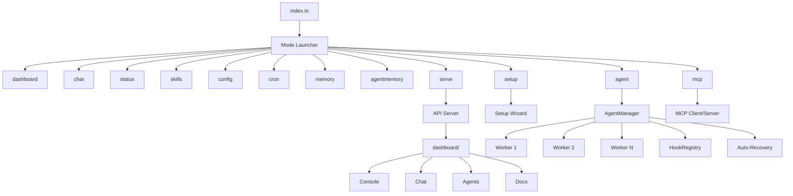

# Neuron OS

*The Operating System for Autonomous AI Agents*

[]()
[]()
[]()
[]()
[]()
[](./LICENSE)
[](https://github.com/KunjShah95/neuron-os)

---

> **Neuron OS** is a local-first, TypeScript-native operating system for autonomous AI agents. Spawn typed agents, watch them work in real-time across terminal/web/chat/API surfaces, and trust every action through built-in audit logging, per-agent tool policies, and cost attribution.

## Quick Start

**Zero install — just run:**

```bash
npx @kunjshah/aegis                # interactive mode picker
npx @kunjshah/aegis status         # system overview
npx @kunjshah/aegis chat           # streaming AI chat
npx @kunjshah/aegis dashboard      # live agent monitoring TUI
npx @kunjshah/aegis serve          # start REST API server
```

The shim downloads the prebuilt binary on first run and caches it at `~/.aegis/bin/`.
If you have [Bun](https://bun.sh) installed, `bunx @kunjshah/aegis` skips the download and runs TypeScript directly.

**Or install from source** (for development):

```bash
git clone https://github.com/KunjShah95/neuron-os.git
cd neuron-os
bun install

bun run index.ts                   # interactive mode picker
bun run index.ts dashboard         # Live agent monitoring TUI
bun run index.ts chat              # Streaming AI chat
bun run index.ts status            # System overview
bun run index.ts serve             # Start REST API server
```

**Prerequisites:** [Bun](https://bun.sh) >= 1.3.14

---

## What's in the Box

### TUI Modes (12)

Run `aegis` (no args) for the interactive mode picker, or launch directly:

| Mode | Command | Alias | Description |
|------|---------|-------|-------------|
| Mode Launcher | `aegis` / `wakeup` | `w` | Interactive mode selector |
| Dashboard | `dashboard` | `dash` | Real-time agent monitoring TUI |
| Chat | `chat` | `c` | Streaming AI chat with multi-provider support |
| Status | `status` | `st` | System health overview |
| Skills | `skills` | `sk` | Browse and manage skills |
| Config | `config` | `cfg` | Credential vault and settings |
| Cron | `cron` | | Scheduled job management |
| Memory | `memory` | | Long-term memory, vector search, knowledge graph |
| AgentMemory | `agentmemory` | `am` | Hybrid BM25+Vector+Graph sidecar |
| Agent Manager | `agent` | `a` | Spawn, kill, inspect agents |
| Setup | `setup` | | Interactive configuration wizard |
| API Server | `serve` | | HTTP REST API + WebSocket |
| MCP | `mcp` | | Model Context Protocol client/server |
| Cost | `cost` | | Per-task, per-agent cost attribution |
| Router | `router` | | Auto-select cheapest provider per task |
| Estimate | `estimate` | | Pre-flight cost check before spawning |
| Insights | `insights` | | Cross-DB analytics across all stores |
| Benchmark | `benchmark` | | Agent quality regression detection |
| Bench | `bench` | | Provider benchmark comparison |
| Improve | `improve` | | Self-learning: skill extraction, failure clustering |
| Production | `production` | | RBAC, vault, SLO, traces, background agents |
| Distributed | `distributed` | | Multi-host worker pool, leader election |
| Router | `router` | | Model router for cheapest viable provider |

### Web Frontends

| Directory | Purpose | Stack |
|-----------|---------|-------|
| [`website/`](website/) | Public marketing site | Vite + React 19 + Framer Motion 12 + Tailwind 3 |
| [`dashboard/`](dashboard/) | Web app (Console, Chat, Agents, Docs, etc.) | Vite + React 19 + React Router 7 + Tailwind 3 |

```bash
cd website && bun install && bun run dev    # :5173
cd dashboard && bun install && bun run dev  # :5173, proxies /api to :8080
```

### Agent System (14 Types)

Spawn typed agents with scoped tools, auto-recovery, and lifecycle hooks:

| Type | Mode | Tools | Description |
|------|------|-------|-------------|
| `build` | primary | all | Full-access development agent |
| `plan` | primary | read-only | Architecture and planning |
| `main` | primary | read, web, bash | Default agent type |
| `read` | subagent | read-only | Fast codebase exploration |
| `write` | subagent | write/edit/read | File creation and editing |
| `test` | subagent | bash (restricted), read | Test execution |
| `validate` | subagent | read, bash (lint) | Type checking and linting |
| `review` | subagent | read-only | Code review (security, patterns) |
| `debug` | subagent | all | Systematic debugging |
| `document` | subagent | read, write | Documentation generation |
| `refactor` | subagent | read, write, edit | Code restructuring |
| `deploy` | subagent | bash (deploy), read | Deployment and CI/CD |
| `monitor` | subagent | bash, read | File watching and health checks |
| `explore` | subagent | read-only | Lightweight search |

### Multi-Platform Gateway (8 Adapters)

One interface, eight chat platforms. All behind `src/adapters/gateway.ts`:

- Discord bot (Socket Mode)
- Slack bot (Socket Mode)
- Telegram bot
- SMS (Twilio)
- Voice calls (Twilio)
- WhatsApp (Twilio)
- Email (SMTP/Nodemailer)
- Webhook (generic + GitHub)

### AI Providers (13)

Anthropic, OpenAI, DeepSeek, Groq, Gemini, Mistral, Azure OpenAI, Together AI, Ollama (local), OpenRouter, xAI, Cohere, Perplexity — plus custom endpoints. Auto-routed by cost with `aegis router route`. Switch at runtime in chat TUI with `/provider set <name>`.

### Core Features

- **Typed IPC Protocol** — JSON-line messages over stdin/stdout with heartbeat, auto-recovery (exponential backoff)
- **Lifecycle Hooks** — pre/post hooks for spawn, kill, message, error, exit events
- **HMAC-signed REST API** — timing-safe comparison, replay-protection window
- **Session Persistence** — SQLite-backed session store with resume, export, prune, merge
- **Knowledge Graph** — SQLite-backed entity-relationship store with auto-extraction from sessions
- **Vector Memory** — TF-IDF + cosine similarity for semantic search across conversations
- **Unified Memory Query** — Single interface across FTS5 recall, vector, sessions, experience, and graph stores
- **AgentMemory Sidecar** — Optional hybrid BM25+Vector+Graph engine (95.2% R@5 on LongMemEval-S)
- **Cross-Session Synthesis** — `aegis memory synthesize <topic>` merges knowledge across all memory stores
- **Per-Agent Namespaces** — TTL-managed memory scoped by agent type with auto-archival
- **MCP Integration** — Client and server for Model Context Protocol tool interoperability
- **Tool-based Security** — Per-agent-type tool permissions with pattern-restricted bash
- **Skill System** — Extensible skills with local registry and marketplace API
- **Cron Engine** — Scheduled jobs with heartbeat monitoring
- **Trigger Engine** — Cron, file_watch, webhook, condition, and gateway_command triggers
- **Background Agents** — File-watching and scheduled background agent execution
- **Cost Attribution** — Per-task, per-agent, per-session token tracking with USD pricing
- **Model Router** — Auto-selects cheapest viable provider per task type using real pricing data
- **Pre-Flight Cost Check** — Estimates cost before spawning, blocks if over threshold
- **Provider Benchmarking** — `aegis bench providers` compares all 13 providers on quality/cost
- **Auto-Recovery** — Configurable retries with exponential backoff and per-agent state tracking
- **Experience Replay** — Auto-retry failed runs with adaptive strategies, auto-extract skills
- **Self-Improvement Scheduler** — Cron-driven skill extraction (6h) and failure clustering (12h)
- **Adversarial Self-Play** — Red-team agents challenge defenders, finds regressions
- **Distributed Runtime** — Multi-host worker pool with bully leader election and encrypted transport
- **Capacity-Aware Placement** — Workers self-report CPU/memory/GPU, scheduler picks best host
- **Role-Based Access Control** — Admin/operator/developer/viewer roles with SHA-256 hashed API keys
- **Encrypted Credential Vault** — AES-256-GCM secrets with scrypt-derived master key and key rotation
- **SLO Tracking** — Rolling-window uptime, latency, error rate with burn rate calculation
- **Distributed Tracing** — SQLite-backed trace spans with parent-child relationships
- **Production Dashboard** — Aggregated view of SLOs, costs, failures, and agent health
- **Cross-DB Insights** — Joins audit, billing, experience, and telemetry databases

---

## Architecture



### Module Breakdown

| Module | Path | Responsibility |
|--------|------|----------------|
| CLI | `src/cli/` | Command registration, banner, theme, palette |
| Modes | `src/modes/` | Mode framework + 12 TUI mode screens |
| Agent | `src/agent/` | Agent lifecycle, process management, IPC, hooks |
| Dashboard TUI | `src/tui/` | Dashboard rendering, state management, commands |
| Chat TUI | `src/chat/` | Chat UI, streaming, provider integration, sessions |
| Web Dashboard | `dashboard/` | Vite + React 19 frontend with 12 route pages |
| Wizard | `src/wizard/` | Interactive setup flows |
| Tools | `src/tools/` | Tool registry and 8 built-in tool implementations |
| Skills | `src/skills/` | Skill loading, registry, and remote API client |
| Memory | `src/memory/` | Session persistence, knowledge graph, vector, namespaces, synthesis |
| Experience | `src/experience/` | Experience replay buffer, retrieval, skill curation |
| Economy | `src/economy/` | Cost routing, pricing registry, budget guard, pre-flight checks |
| Improve | `src/improve/` | Skill extraction, failure clustering, adversarial self-play |
| Distributed | `src/distributed/` | Worker pool, encrypted transport, capacity placement, management |
| Adapters | `src/adapters/` | 8-platform gateway (Discord, Slack, Telegram, etc.) |
| API | `src/api/` | HTTP REST API server with HMAC + RBAC authentication |
| AI | `src/ai/` | Provider manager (13 providers), factory, model references |
| Auth | `src/auth/` | RBAC role management, API key auth, HTTP middleware |
| Vault | `src/vault/` | AES-256-GCM credential vault, env loader, provider bridge |
| Observability | `src/observability/` | SLO tracking, distributed tracing, production dashboard |
| Triggers | `src/triggers/` | Cron, file_watch, webhook, condition, background agents |
| Audit | `src/audit/` | Append-only audit logging for all agent actions |
| Billing | `src/billing/` | Per-LLM-call cost tracking, budget enforcement |

---

## Security Model

- **Per-agent tool permissions** — read, write, edit, bash, grep, glob, web_fetch, web_search, read_skill
- **Pattern-restricted bash** — test, validate, deploy agents can only run approved command patterns
- **HMAC-signed API** — all REST endpoints require signed requests with replay protection
- **RBAC** — Admin/operator/developer/viewer roles with SHA-256 hashed API keys; permission checks on every route
- **Auditable** — all agent actions logged with timestamps to append-only audit log
- **Encrypted credential vault** — AES-256-GCM with scrypt-derived master key, per-entry random IVs, key rotation
- **Distributed transport encryption** — AES-256-GCM between workers with SHA-256 derived shared key
- **Vault-to-provider bridge** — API keys stored in vault auto-sync to provider resolution at unlock
- **User-level permissions** — agents operate with the user's filesystem permissions
- **Local by default** — all agents run locally unless explicitly configured otherwise
- **Zero-trust isolation** — Docker container sandboxing for high-risk agent types

---

## Setup

### Environment Variables

| Variable | Required | Description |
|----------|----------|-------------|
| `ANTHROPIC_API_KEY` | For Anthropic | Anthropic API key |
| `OPENAI_API_KEY` | For OpenAI | OpenAI API key |
| `DEEPSEEK_API_KEY` | For DeepSeek | DeepSeek API key |
| `GROQ_API_KEY` | For Groq | Groq API key |
| `GOOGLE_GENERATIVE_AI_API_KEY` | For Gemini | Google Gemini API key |
| `MISTRAL_API_KEY` | For Mistral | Mistral API key |
| `AZURE_OPENAI_API_KEY` | For Azure | Azure OpenAI key |
| `TOGETHERAI_API_KEY` | For Together AI | Together AI key |
| `OPENROUTER_API_KEY` | For OpenRouter | OpenRouter API key |
| `XAI_API_KEY` | For xAI | xAI API key |
| `COHERE_API_KEY` | For Cohere | Cohere API key |
| `PERPLEXITY_API_KEY` | For Perplexity | Perplexity API key |
| `OLLAMA_URL` | For Ollama | Base URL for local Ollama server |
| `AEGIS_DEFAULT_PROVIDER` | Optional | Default provider name |
| `AEGIS_LOG_LEVEL` | Optional | Log level: debug, info, warn, error |
| `AEGIS_MODEL_ROUTER` | Optional | Set to `disabled` to bypass model routing |
| `AEGIS_PREFLIGHT` | Optional | Set to `disabled` to skip pre-flight cost checks |
| `AEGIS_DISTRIBUTED` | Optional | Enable distributed runtime worker pool |
| `AEGIS_CLUSTER_SECRET` | Optional | Shared secret for distributed transport encryption |
| `AGENTMEMORY_URL` | Optional | agentmemory sidecar URL (default: http://localhost:3111) |
| `AGENTMEMORY_SECRET` | Optional | Bearer token for agentmemory auth |
| `AGENTMEMORY_ENABLED` | Optional | Set to `false` to disable |

### Interactive Setup

```bash
bun run index.ts setup    # Guided provider configuration
bun run index.ts setup-keys  # Configure API keys
bun run index.ts doctor    # Verify installation
```

### Runtime Provider Switching

In the chat TUI:
```
/provider list                    # List available providers
/provider set openai             # Switch to OpenAI
/provider set anthropic model=claude-sonnet-4-20250514  # With model
```

---

## Development

```bash
# TypeScript typecheck
bun run typecheck

# Run all tests
bun run test

# Individual test suites
bun run test:dashboard     # Dashboard TUI tests (54)
bun run test:chat          # Chat TUI tests (164)
bun run src/agent/test-manager.ts       # Agent manager tests (7)
bun run src/memory/test-agentmemory.ts  # AgentMemory connector tests (42)

# Build web dashboard
cd dashboard && bun run build

# Build marketing website
cd website && bun run build

# Run CI suite
bun run ci
```

### Extending

- **New mode** — create file in `src/modes/`, implement `Mode` interface, register in `src/modes/index.ts`
- **New CLI command** — create file in `src/cli/commands/`, register in `index.ts`
- **New agent type** — add to `AGENT_TYPES` in `src/agent/agent-types.ts`
- **New tool** — implement tool function, register in `src/tools/registry.ts`
- **New dashboard page** — create route in `dashboard/src/routes/`, add to `App.tsx` and `Sidebar.tsx`
- **New adapter** — implement gateway interface in `src/adapters/`

---

## Docker

Multi-stage Dockerfile included for production deployment:

```bash
# Build
docker build -t neuron-os/aegis:latest .

# Run API server
docker run -p 8080:8080 \
  -e ANTHROPIC_API_KEY=sk-... \
  neuron-os/aegis:latest

# Compose (local dev with hot reload)
docker compose --profile dev up
```

---

## Roadmap (2026-2027)

Neuron OS has shipped 4 major milestones since v0.2.0. The roadmap below shows what's built and what's next.

### ✅ v0.7.0 — Cost Attribution & Benchmarking — **SHIPPED**

**What we delivered:**
- `aegis cost {total,models,sessions,history,budget,report}` CLI with real USD pricing
- `aegis benchmark {run,status,baseline}` with regression detection and CI-compatible JSON output
- `aegis bench providers "<task>"` — benchmarks all 13 providers on quality + cost
- `aegis insights` — cross-DB analytics joining audit, billing, experience, and telemetry stores
- `aegis router route/list/suggest` — auto-selects cheapest viable provider per task type
- `aegis estimate` — pre-flight cost estimation before agent spawning, with warn/block thresholds
- Model router wired into agent spawning — `AEGIS_MODEL_HINT` auto-set to cheapest provider
- 13 providers tracked in pricing registry with real per-1k-token costs

---

### ✅ v0.8.0 — Knowledge Graph & Long-Term Memory — **SHIPPED**

**What we delivered:**
- SQLite-backed knowledge graph with entity extraction, relationship linking, confidence scoring
- Per-agent memory namespaces with TTL-based expiry and archival
- Cross-session knowledge synthesis (`aegis memory synthesize <topic>`) across 5 stores
- Unified Memory Query — single interface searching FTS5 recall, vector memory, sessions, experience, and graph
- Auto-extraction from agent sessions — every completed session populates the knowledge graph
- `aegis memory graph {add-entity,link,search,related,stats}`
- `aegis memory ns {create,add,query,prune}`

---

### ✅ v0.9.0 — Distributed Runtime — **SHIPPED**

**What we delivered:**
- Multi-host worker pool with TCP-based leader election (bully algorithm)
- AES-256-GCM encrypted transport between workers with SHA-256 key derivation
- Capacity-aware placement — workers self-report CPU, memory, GPU; scheduler scores and picks best host
- Remote management HTTP API (6 routes: health, workers, task dispatch, election)
- Worker heartbeat monitoring with automatic timeout
- `aegis distributed {start,status,workers,task,info}`
- Distributed spawn integration in AgentManager — auto-dispatches to remote workers when configured
- HMAC-signed management API with optional `X-Aegis-Signature` header

---

### ✅ v0.10.0 — Self-Improving Agents — **SHIPPED**

**What we delivered:**
- Skill candidate extraction from successful experiences — clustering by embedding similarity
- Failure clustering by goal + tag overlap with severity scoring
- Adversarial self-play — 8 scenario templates, attacker vs defender, regression detection
- Auto-skill packaging — validated candidates published to `src/skills/auto-*.ts`
- Self-improvement scheduler — cron-driven skill extraction (every 6h) and failure clustering (every 12h)
- `aegis improve skill {extract,list,validate,publish,reject,stats}`
- `aegis improve failure {cluster,list,fix,retry}`
- `aegis improve adversarial {run,results,analyze}`
- `aegis improve scheduler {init,remove,status,run}`
- Wired into agent lifecycle — completed agents flagged for skill extraction; failed agents flagged for clustering

---

### ✅ v1.0.0 — Production-Ready — **SHIPPED**

**What we delivered:**
- RBAC with admin/operator/developer/viewer roles, SHA-256 hashed API keys, route-permission mapping
- Encrypted credential vault — AES-256-GCM with scrypt-derived master key, per-entry IVs, expiration tracking
- Vault-to-provider bridge — API keys in vault auto-sync to provider resolution at unlock
- SLO tracking — rolling-window uptime, latency, error rate with burn rate calculation
- Distributed tracing — SQLite-backed trace spans with parent-child relationships
- Production dashboard — aggregated SLOs, costs, failures, agent health
- `aegis serve --auth` — RBAC-enabled HTTP server with permission checks on all routes (17 route patterns)
- `aegis production {rbac,vault,slo,dashboard,trace,background}`
- Background agents — file-watching and scheduled agents via TriggerEngine
- `aegis trigger background {list,register}`
- Event-driven triggers already existed: cron, file_watch, webhook, condition, gateway_command

---

### 🔮 H2 2026 — Plugin Marketplace & WebSocket Gateway

**Theme:** Extend without forks. Collaborate in real-time.

| Milestone | Deliverable | 
|-----------|-------------|
| **Plugin Registry** | Signed plugins with version resolution, dependency management |
| **Plugin CLI** | `aegis plugin {publish,install,list,remove}` with signature verification |
| **WebSocket Gateway** | Real-time multi-user dashboards with per-user agent state |
| **Multi-User Sessions** | Shared agent workspaces with activity streaming |

---

### 🔮 Q1 2027 — Multi-Agent Teams at Scale

**Theme:** Teams form and dissolve around tasks, not topology.

| Milestone | Deliverable |
|-----------|-------------|
| **Typed Multi-Agent Trees** | Agents declare inputs, outputs, preconditions |
| **Coordinator Election** | Dynamic lead agent selection by capability matching |
| **Debate Topology** | Third-agent arbitration for agent disagreement resolution |
| **Cross-Team Memory** | Team A's learnings queryable by Team B with explicit access policies |

---

### 🔮 Q2 2027 — Tool-Level Economy & Agent Bidding

**Theme:** Every action has a price. Every dollar has a benchmark.

| Milestone | Deliverable |
|-----------|-------------|
| **Per-Tool Pricing** | Every tool has compute/API/I/O cost + latency profile |
| **Budgeted Agents** | `budget_usd` on task def; agent self-throttles spend |
| **Spot Routing** | Cross-provider cost router picks current cheapest provider |
| **Public Benchmarks** | `quality / USD` leaderboard per provider per task class |
| **Cost Spike Alerts** | Automated Slack/Discord alerts on budget breach |

---

### 🔮 H2 2027 — Self-Improving Runtime (Karpathy-Delta Closure)

**Theme:** The system closes the loop — extract, validate, publish, repeat.

| Milestone | Deliverable |
|-----------|-------------|
| **Auto-Skill Packaging** | Passing skill candidates auto-published with quality gates |
| **Failure Prioritization** | Grouped failures ranked by frequency and blast radius |
| **Adversarial Regression** | Red-team findings auto-fed into system prompts as known patterns |
| **Dashboard v2** | Knowledge graph visualization in web app

---

## Contributing

1. **Open a Discussion** in the [RFCs category](https://github.com/KunjShah95/neuron-os/discussions/categories) for cross-module features
2. **Open an issue** labeled `roadmap` for focused, single-module proposals
3. **Pick up a spec** from [`docs/superpowers/specs/`](docs/superpowers/specs/) and ship it

See [ROADMAP.md](ROADMAP.md) for the full strategic roadmap and [docs/](docs/) for complete documentation.

---

## License

MIT

---

<p align="center">
  <a href="https://github.com/KunjShah95/neuron-os">GitHub</a> ·
  <a href="https://github.com/KunjShah95/neuron-os/discussions">Discussions</a> ·
  <a href="https://github.com/KunjShah95/neuron-os/issues">Issues</a>
</p>
