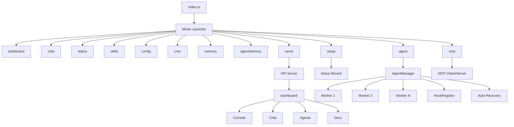

# Neuron OS

*The Operating System for Autonomous AI Agents*

[]()
[]()
[]()
[]()
[]()
[](./LICENSE)
[](https://github.com/KunjShah95/neuron-os)

---

> **Neuron OS** is a local-first, TypeScript-native operating system for autonomous AI agents. Spawn typed agents, watch them work in real-time across terminal/web/chat/API surfaces, and trust every action through built-in audit logging, per-agent tool policies, and cost attribution.

## Quick Start

```bash
# Clone and install
git clone https://github.com/KunjShah95/neuron-os.git
cd neuron-os
bun install

# Launch the interactive mode picker
bun run index.ts
# or explicitly
bun run index.ts wakeup

# Or go straight to a mode
bun run index.ts dashboard   # Live agent monitoring TUI
bun run index.ts chat          # Streaming AI chat
bun run index.ts status        # System overview
bun run index.ts serve         # Start REST API server
```

**Prerequisites:** [Bun](https://bun.sh) >= 1.3.14

---

## What's in the Box

### TUI Modes (12)

Run `aegis` (no args) for the interactive mode picker, or launch directly:

| Mode | Command | Alias | Description |
|------|---------|-------|-------------|
| Mode Launcher | `aegis` / `wakeup` | `w` | Interactive mode selector |
| Dashboard | `dashboard` | `dash` | Real-time agent monitoring TUI |
| Chat | `chat` | `c` | Streaming AI chat with multi-provider support |
| Status | `status` | `st` | System health overview |
| Skills | `skills` | `sk` | Browse and manage skills |
| Config | `config` | `cfg` | Credential vault and settings |
| Cron | `cron` | | Scheduled job management |
| Memory | `memory` | | Long-term memory & vector search |
| AgentMemory | `agentmemory` | `am` | Hybrid BM25+Vector+Graph sidecar |
| Agent Manager | `agent` | `a` | Spawn, kill, inspect agents |
| Setup | `setup` | | Interactive configuration wizard |
| API Server | `serve` | | HTTP REST API + WebSocket |
| MCP | `mcp` | | Model Context Protocol client/server |

### Web Frontends

| Directory | Purpose | Stack |
|-----------|---------|-------|
| [`website/`](website/) | Public marketing site | Vite + React 19 + Framer Motion 12 + Tailwind 3 |
| [`dashboard/`](dashboard/) | Web app (Console, Chat, Agents, Docs, etc.) | Vite + React 19 + React Router 7 + Tailwind 3 |

```bash
cd website && bun install && bun run dev    # :5173
cd dashboard && bun install && bun run dev  # :5173, proxies /api to :8080
```

### Agent System (14 Types)

Spawn typed agents with scoped tools, auto-recovery, and lifecycle hooks:

| Type | Mode | Tools | Description |
|------|------|-------|-------------|
| `build` | primary | all | Full-access development agent |
| `plan` | primary | read-only | Architecture and planning |
| `main` | primary | read, web, bash | Default agent type |
| `read` | subagent | read-only | Fast codebase exploration |
| `write` | subagent | write/edit/read | File creation and editing |
| `test` | subagent | bash (restricted), read | Test execution |
| `validate` | subagent | read, bash (lint) | Type checking and linting |
| `review` | subagent | read-only | Code review (security, patterns) |
| `debug` | subagent | all | Systematic debugging |
| `document` | subagent | read, write | Documentation generation |
| `refactor` | subagent | read, write, edit | Code restructuring |
| `deploy` | subagent | bash (deploy), read | Deployment and CI/CD |
| `monitor` | subagent | bash, read | File watching and health checks |
| `explore` | subagent | read-only | Lightweight search |

### Multi-Platform Gateway (8 Adapters)

One interface, eight chat platforms. All behind `src/adapters/gateway.ts`:

- Discord bot (Socket Mode)
- Slack bot (Socket Mode)
- Telegram bot
- SMS (Twilio)
- Voice calls (Twilio)
- WhatsApp (Twilio)
- Email (SMTP/Nodemailer)
- Webhook (generic + GitHub)

### AI Providers (6)

Anthropic, OpenAI, DeepSeek, Mistral, Azure OpenAI, Together AI, Ollama (local), and custom endpoints. Switch at runtime in chat TUI with `/provider set <name>`.

### Core Features

- **Typed IPC Protocol** — JSON-line messages over stdin/stdout with heartbeat, auto-recovery (exponential backoff)
- **Lifecycle Hooks** — pre/post hooks for spawn, kill, message, error, exit events
- **HMAC-signed REST API** — timing-safe comparison, replay-protection window
- **Session Persistence** — SQLite-backed session store with resume, export, prune
- **Vector Memory** — TF-IDF + cosine similarity for semantic search across conversations
- **AgentMemory Sidecar** — Optional hybrid BM25+Vector+Graph engine (95.2% R@5 on LongMemEval-S)
- **MCP Integration** — Client and server for Model Context Protocol tool interoperability
- **Tool-based Security** — Per-agent-type tool permissions with pattern-restricted bash
- **Skill System** — Extensible skills with local registry and marketplace API
- **Cron Engine** — Scheduled jobs with heartbeat monitoring
- **Cost Attribution** — Per-task, per-agent, per-session token tracking (v0.7.0+)
- **Auto-Recovery** — Configurable retries with exponential backoff and per-agent state tracking

---

## Architecture



### Module Breakdown

| Module | Path | Responsibility |
|--------|------|----------------|
| CLI | `src/cli/` | Command registration, banner, theme, palette |
| Modes | `src/modes/` | Mode framework + 12 TUI mode screens |
| Agent | `src/agent/` | Agent lifecycle, process management, IPC, hooks |
| Dashboard TUI | `src/tui/` | Dashboard rendering, state management, commands |
| Chat TUI | `src/chat/` | Chat UI, streaming, provider integration, sessions |
| Web Dashboard | `dashboard/` | Vite + React 19 frontend with 12 route pages |
| Wizard | `src/wizard/` | Interactive setup flows |
| Tools | `src/tools/` | Tool registry and 8 built-in tool implementations |
| Skills | `src/skills/` | Skill loading, registry, and remote API client |
| Memory | `src/memory/` | Session persistence, memory system, vector search |
| Adapters | `src/adapters/` | 8-platform gateway (Discord, Slack, Telegram, etc.) |
| API | `src/api/` | HTTP REST API server with HMAC authentication |
| AI | `src/ai/` | Provider manager, factory, model references |
| Cron | `src/cron/` | Cron engine (add, remove, list, heartbeat) |

---

## Security Model

- **Per-agent tool permissions** — read, write, edit, bash, grep, glob, web_fetch, web_search, read_skill
- **Pattern-restricted bash** — test, validate, deploy agents can only run approved command patterns
- **HMAC-signed API** — all REST endpoints require signed requests with replay protection
- **Auditable** — all agent actions logged with timestamps to append-only audit log
- **Encrypted vault** — AES-256-GCM credential storage with key rotation support
- **User-level permissions** — agents operate with the user's filesystem permissions
- **Local by default** — all agents run locally unless explicitly configured otherwise

---

## Setup

### Environment Variables

| Variable | Required | Description |
|----------|----------|-------------|
| `ANTHROPIC_API_KEY` | For Anthropic | Anthropic API key |
| `OPENAI_API_KEY` | For OpenAI | OpenAI API key |
| `DEEPSEEK_API_KEY` | For DeepSeek | DeepSeek API key |
| `MISTRAL_API_KEY` | For Mistral | Mistral API key |
| `AZURE_OPENAI_KEY` | For Azure | Azure OpenAI key |
| `TOGETHER_API_KEY` | For Together AI | Together AI key |
| `OLLAMA_URL` | For Ollama | Base URL for local Ollama server |
| `AEGIS_DEFAULT_PROVIDER` | Optional | Default provider name |
| `AEGIS_LOG_LEVEL` | Optional | Log level: debug, info, warn, error |
| `AGENTMEMORY_URL` | Optional | agentmemory sidecar URL (default: http://localhost:3111) |
| `AGENTMEMORY_SECRET` | Optional | Bearer token for agentmemory auth |
| `AGENTMEMORY_ENABLED` | Optional | Set to `false` to disable |

### Interactive Setup

```bash
bun run index.ts setup    # Guided provider configuration
bun run index.ts setup-keys  # Configure API keys
bun run index.ts doctor    # Verify installation
```

### Runtime Provider Switching

In the chat TUI:
```
/provider list                    # List available providers
/provider set openai             # Switch to OpenAI
/provider set anthropic model=claude-sonnet-4-20250514  # With model
```

---

## Development

```bash
# TypeScript typecheck
bun run typecheck

# Run all tests
bun run test

# Individual test suites
bun run test:dashboard     # Dashboard TUI tests (54)
bun run test:chat          # Chat TUI tests (164)
bun run src/agent/test-manager.ts       # Agent manager tests (7)
bun run src/memory/test-agentmemory.ts  # AgentMemory connector tests (42)

# Build web dashboard
cd dashboard && bun run build

# Build marketing website
cd website && bun run build

# Run CI suite
bun run ci
```

### Extending

- **New mode** — create file in `src/modes/`, implement `Mode` interface, register in `src/modes/index.ts`
- **New CLI command** — create file in `src/cli/commands/`, register in `index.ts`
- **New agent type** — add to `AGENT_TYPES` in `src/agent/agent-types.ts`
- **New tool** — implement tool function, register in `src/tools/registry.ts`
- **New dashboard page** — create route in `dashboard/src/routes/`, add to `App.tsx` and `Sidebar.tsx`
- **New adapter** — implement gateway interface in `src/adapters/`

---

## Docker

Multi-stage Dockerfile included for production deployment:

```bash
# Build
docker build -t neuron-os/aegis:latest .

# Run API server
docker run -p 8080:8080 \
  -e ANTHROPIC_API_KEY=sk-... \
  neuron-os/aegis:latest

# Compose (local dev with hot reload)
docker compose --profile dev up
```

---

## 1-Year Roadmap (2026-2027)

Neuron OS is evolving from a local agent runtime into a **production-ready autonomous agent operating system**. The roadmap below breaks the next year into quarterly milestones with clear deliverables and exit criteria.

### ✅ Q2 2026 — Multi-Platform Gateway (v0.6.0) — **SHIPPED**

**What we delivered:**
- 8 first-class adapters (Discord, Slack, SMS, Voice, WhatsApp, Email, Webhook, Bot-Commands)
- HMAC-signed REST API with replay protection
- Per-adapter test coverage
- `aegis gateway start` multi-adapter daemon
- Marketing website with docs, changelog, FAQ
- Web dashboard with 12 routes, real-time agents, session management

---

### 🔨 Q3 2026 — Stabilization & Cost Control (v0.3.x → v0.7.0)

**Theme:** Harden the core, control costs, know what every agent spends.

| Milestone | Deliverable | Exit Criteria |
|-----------|-------------|---------------|
| **CI/CD Hardening** | Full test matrix (Linux, macOS, Windows) | All PRs blocked on green CI |
| **Test Coverage** | 80% line coverage across `src/` | `bun run test` passes with ≥80% |
| **SQLite Cost Store** | Per-agent, per-task token tracking | `aegis cost week` shows real data |
| **Budget Enforcement** | Hard/soft budgets with auto-throttle | Agent stops at budget limit |
| **Provider Router** | Auto-select cheapest capable provider | Benchmark data drives routing |
| **Cost Alerts** | Dashboard cost charts + spike detection | Slack/Discord alerts on budget breach |
| **Config Validation** | JSON Schema for all config files | `aegis doctor` validates config |

**Key features:**
- 13 LLM provider cost tracking (Anthropic, OpenAI, DeepSeek, Mistral, Azure, Together AI, Ollama, and more)
- Docker production builds with multi-arch support (AMD64, ARM64)
- Agent auto-recovery stress testing
- Windows Terminal support polish

---

### 🧠 Q4 2026 — Intelligence & Memory (v0.8.0)

**Theme:** Agents that remember, learn, and improve.

| Milestone | Deliverable | Exit Criteria |
|-----------|-------------|---------------|
| **Episodic Memory** | Session history with semantic search | Query by meaning, not keyword |
| **Knowledge Graph** | Structured facts with provenance | Every fact cites its source session |
| **Skill Evolution** | Auto-extract skills from successful runs | Passing skills auto-published |
| **Experience Replay** | Failure clustering + pattern detection | Same failure never happens twice |
| **Memory Namespaces** | Per-project, per-agent TTL + archival | `aegis memory synthesize <topic>` works |
| **Dashboard v2** | Knowledge graph visualization | Web app shows memory as graph |

**Key features:**
- BM25 + Vector + Graph hybrid search (AgentMemory sidecar at 95.2% R@5)
- Per-project memory namespaces with TTL
- Cross-session knowledge synthesis
- Adversarial self-play with red-team findings registry
- Agent answers questions about projects from 30+ days ago

---

### 🌐 Q1 2027 — Distribution & Teams (v0.9.0)

**Theme:** Run anywhere. Work together.

| Milestone | Deliverable | Exit Criteria |
|-----------|-------------|---------------|
| **Multi-Host Runtime** | Leader + worker pool across machines | `replicas: 10` distributes across 3 hosts |
| **Encrypted Transport** | Noise protocol for worker communication | Wireshark shows encrypted payloads |
| **RBAC v1** | Per-role tool permissions + audit | `aegis rbac assign` works end-to-end |
| **Plugin Marketplace** | Signed plugins with version resolution | Install from registry: `aegis plugin install <name>` |
| **Background Agents** | File-watching + event-driven triggers | Save file → build agent auto-spawns |
| **WebSocket Gateway** | Real-time multi-user dashboards | Multiple users see same agent state |

**Key features:**
- Agent-to-agent IPC for typed multi-agent trees
- Coordinator election for dynamic team formation
- Disagreement resolution with debate topology
- Cross-team memory with explicit access policies

---

### 🏭 Q2 2027 — Production-Ready (v1.0.0)

**Theme:** Ship it. Sleep at night.

| Milestone | Deliverable | Exit Criteria |
|-----------|-------------|---------------|
| **SLA Dashboards** | 99th percentile latency, uptime, error rate | Public status page |
| **Incident Playbooks** | Automated runbooks for common failures | `aegis incident` generates report |
| **Hardened Vault** | AES-256-GCM with key rotation | Key rotation without downtime |
| **E2E Observability** | Traces, metrics, logs in one queryable store | Jaeger/Zipkin-compatible export |
| **Sandboxed Execution** | Docker-based agent sandboxes | Untrusted code runs isolated |
| **Certification** | Security audit + performance benchmarks | Third-party audit report published |

**Exit criteria for v1.0.0:**
- A 50-engineer team can adopt Aegis as their primary agent platform without vendor involvement
- The 99th percentile of "why did this agent do that?" is answerable in under 5 minutes
- 99.9% uptime with automated recovery for all critical paths

---

### 🚀 Beyond v1.0.0 — The Long Game

**Self-Improving Runtime (Karpathy-delta closure)**
- Skill candidate extraction from successful patterns
- Failure clustering and prioritized improvement suggestions
- Auto-skill packaging with quality gates
- Adversarial self-play (red-team agents feed regressions back)

**Tool-Level Economy**
- Per-tool pricing registry (compute, API, I/O costs)
- Budgeted agents with self-throttling
- Cross-provider cost router at runtime
- Public `quality / USD` benchmarks per provider

**Multi-Agent Teams at Scale**
- Typed multi-agent trees (inputs, outputs, preconditions)
- Coordinator election by capability
- Disagreement resolution with debate topology
- Cross-team memory with explicit access policies

---

## Contributing

1. **Open a Discussion** in the [RFCs category](https://github.com/KunjShah95/neuron-os/discussions/categories) for cross-module features
2. **Open an issue** labeled `roadmap` for focused, single-module proposals
3. **Pick up a spec** from [`docs/superpowers/specs/`](docs/superpowers/specs/) and ship it

See [ROADMAP.md](ROADMAP.md) for the full strategic roadmap and [docs/](docs/) for complete documentation.

---

## License

MIT

---

<p align="center">
  <a href="https://github.com/KunjShah95/neuron-os">GitHub</a> ·
  <a href="https://github.com/KunjShah95/neuron-os/discussions">Discussions</a> ·
  <a href="https://github.com/KunjShah95/neuron-os/issues">Issues</a>
</p>
