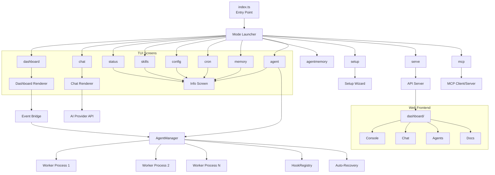
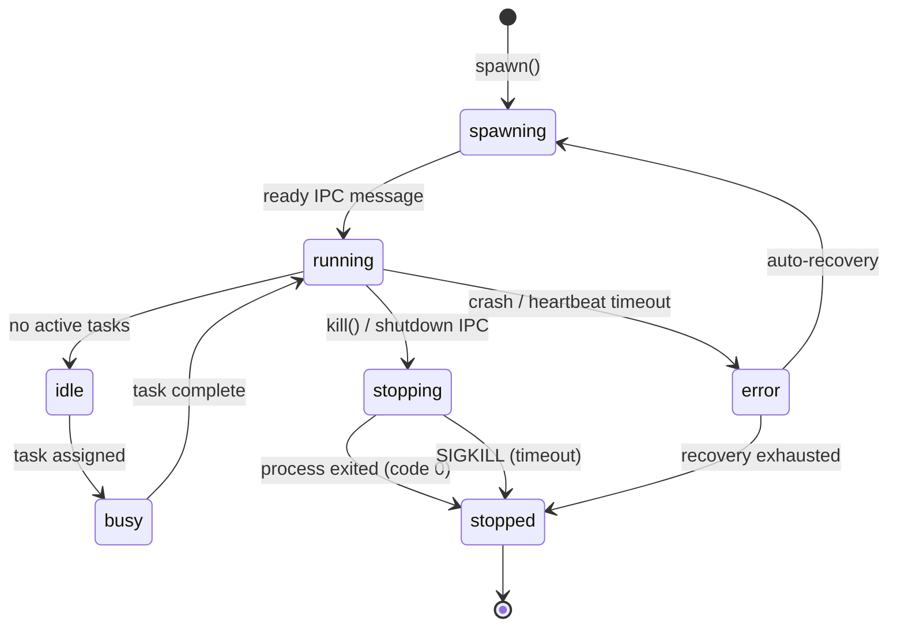

```text
    █████╗ ███████╗ ██████╗ ██╗███████╗
   ██╔══██╗██╔════╝██╔════╝ ██║██╔════╝
   ███████║█████╗  ██║  ███╗██║███████╗
   ██╔══██║██╔══╝  ██║   ██║██║╚════██║
   ██║  ██║███████╗╚██████╔╝██║███████║
   ╚═╝  ╚═╝╚══════╝ ╚═════╝ ╚═╝╚══════╝
```

*The Operating System for Autonomous AI Agents*

[]()
[]()
[]()
[]()
[](https://github.com/KunjShah95/neuron-os/actions/workflows/docs.yml)

---

## Features

- **12 TUI modes** — unified mode launcher (just run `aegis`), with Dashboard, Chat, Status, Skills, Config, Cron, Memory, Agent Manager, AgentMemory, Setup, API Server, and MCP screens
- **14 specialized agent types** — build, plan, read, write, test, validate, review, debug, document, refactor, deploy, monitor, explore, main
- **Web-based dashboard** — Vite + React 19 + Tailwind CSS frontend with 12 route pages, API proxy, Framer Motion animations (`dashboard/`)
- **Live Dashboard TUI** — real-time agent monitoring with activity log, agent cards, command bar, and status bar
- **Streaming Chat TUI** — multi-provider AI chat with Anthropic, OpenAI, DeepSeek, Ollama, and custom endpoints
- **Auto-recovery** — respawn crashed agents with exponential backoff (configurable retries, multiplier, cap)
- **Lifecycle hook system** — pre/post hooks for spawn, kill, message, error, and exit events
- **JSON-line IPC protocol** — structured stdin/stdout communication between parent and worker processes
- **Interactive setup wizard** — guided provider configuration with 5 AI providers
- **Session persistence** — chat conversations auto-saved and resumable via `/sessions` commands
- **Web tools** — built-in web fetch and web search tools for AI agents
- **MCP integration** — Model Context Protocol client/server for tool interoperability
- **Vector memory** — semantic search across conversations and facts
- **AgentMemory sidecar** — optional hybrid BM25+Vector+Graph search engine with session capture/replay and knowledge graph (95.2% R@5 on LongMemEval-S)
- **Skill integration** — extensible skill system with local registry and skills.sh API client
- **Multi-platform** — Windows (cmd), macOS, and Linux support
- **Tool-based security** — per-agent-type tool permissions with pattern-restricted bash access

---

## Quick Start

### Prerequisites

- **Bun** ≥ 1.3.14 — [bun.sh](https://bun.sh)

### Install

```bash
git clone <repo-url> neuron-os
cd neuron-os
bun install
```

### Run

```bash
# Mode launcher (default) — shows interactive TUI with 12 mode options
bun run index.ts

# Or use the wakeup command explicitly
bun run index.ts wakeup

# Launch a mode directly
bun run index.ts dashboard   # Agent monitoring
bun run index.ts chat        # AI chat
bun run index.ts status      # System info
bun run index.ts skills      # Skills browser
```

### Global install (optional)

```bash
bun link
aegis          # Mode launcher
aegis dash     # Dashboard directly
aegis chat     # Chat directly
```

---

## Commands

### TUI Modes

Launch any mode directly, or run `aegis` with no arguments for the interactive mode launcher.

| Mode | Command | Alias | Description |
|------|---------|-------|-------------|
| Mode Launcher | `aegis` (no args) / `wakeup` | `w` | Interactive mode selector |
| Dashboard | `dashboard` | `dash` | Live agent monitoring TUI |
| Chat | `chat` | `c` | Streaming AI chat TUI |
| Status | `status` | `st` | System status overview |
| Skills | `skills` | `sk` | Installed skills & skills.sh browser |
| Config | `config` | `cfg` | Credential vault viewer |
| Cron | `cron` | | Scheduled jobs overview |
| Memory | `memory` | | Memory, facts & vector search stats |
| AgentMemory | `agentmemory` | `am` | AgentMemory sidecar status & search |
| Agent | `agent` | `a` | Agent management overview |
| Setup | `setup` | | Interactive setup wizard |
| API Server | `serve` | | HTTP API server (start from CLI) |
| MCP | `mcp` | | MCP server config & status |

### Agent subcommands

```bash
aegis agent types                          # List available agent types
aegis agent list [--status <status>]       # List running agents
aegis agent spawn <name> [--type <type>]   # Spawn a new agent worker
aegis agent kill <name> [--force]          # Stop an agent
aegis agent logs <name> [--tail N]         # View agent logs
aegis agent inspect <name>                 # Show detailed agent info
```

### AgentMemory subcommands

```bash
aegis agentmemory status                   # Show connection status and stats
aegis agentmemory search <query>           # Hybrid semantic search
aegis agentmemory connect                  # Test connection to sidecar
```

### Dashboard commands

| Command | Description |
|---------|-------------|
| `spawn <name> [--type <type>]` | Launch an agent worker |
| `kill <name>` / `kill all` | Stop agent(s) |
| `list` | List all agents |
| `status` | Show system info |
| `providers` | List configured AI providers |
| `sessions` / session `delete`, `rename`, `export` | Manage saved chat sessions |
| `help` | Show available commands |

### Dashboard hotkeys

- `Tab` — cycle focus (agents / log / command)
- `Enter` — execute command
- `Ctrl+Q` / `Ctrl+C` — quit

### Chat slash commands

| Command | Description |
|---------|-------------|
| `/provider list` | List available AI providers |
| `/provider set <name> [model=<model>]` | Switch provider at runtime |
| `/sessions list` | List recent saved chat sessions |
| `/sessions load <id>` | Resume a saved session |
| `/clear` | Clear the current chat |

---

## Web Dashboard

A standalone Vite + React 19 + TypeScript + Tailwind CSS frontend lives in `dashboard/`.

### Build

```bash
cd dashboard
bun install
bun run build          # outputs to dashboard/dist/
```

### Development

```bash
cd dashboard
bun run dev            # Vite dev server on :5173, proxies /api to :8080
```

### Pages

| Route | Page | Description |
|-------|------|-------------|
| `/` | Console | Home with greeting, metric cards, story feed |
| `/chat` | Chat | Streaming AI chat with provider picker |
| `/agents` | Agents | Agent spawning, cards, and kill controls |
| `/memory` | Memory | Search, learned facts, activity timeline |
| `/skills` | Skills | Trending skill cards with tags |
| `/status` | Status | Real-time system health and metrics |
| `/config` | Config | Credential vault viewer |
| `/cron` | Cron | Scheduled jobs with enable/disable display |
| `/mcp` | MCP | MCP server connection status |
| `/server` | Server | API server info with endpoint list |
| `/setup` | Setup | Setup wizard steps display |
| `/docs` | Docs | Full CLI command reference with search |

---

## Architecture



### Data Flow

```
User → aegis (no args) → Mode Launcher → Navigation (↑↓ Enter)
                                        → Dashboard (full TUI)
                                        → Chat (full TUI)
                                        → Info Screen (status/skills/config/etc.)
                                        → Setup (interactive wizard)
                                        → Web Dashboard (dashboard/dist/)
```

### Module Breakdown

| Module | Path | Responsibility |
|--------|------|----------------|
| CLI | `src/cli/` | Command registration, banner, theme, palette |
| Modes | `src/modes/` | Mode framework (types, registry, launcher) + 12 mode screens |
| Agent | `src/agent/` | Agent lifecycle, process management, IPC, hooks |
| Dashboard TUI | `src/tui/` | Dashboard rendering, state management, commands |
| Chat TUI | `src/chat/` | Chat UI, streaming, provider integration, session management |
| Web Dashboard | `dashboard/` | Vite + React 19 frontend with 12 route pages |
| Wizard | `src/wizard/` | Interactive setup flows (provider selection, key entry) |
| Tools | `src/tools/` | Tool registry and built-in tool implementations |
| Skills | `src/skills/` | Skill loading, registry, and remote API client |
| Memory | `src/memory/` | Session persistence, memory system, vector search, agentmemory connector |

---

## Agent System

### Agent Types (14)

| Name | Mode | Tools | Model Hint | Description |
|------|------|-------|------------|-------------|
| `build` | primary | all | | Full-access development agent (all tools) |
| `plan` | primary | read-only | claude-opus-4 | Architecture and planning |
| `main` | (implied) | read, web tools, bash | | Default agent type |
| `read` | subagent | read-only | | Fast codebase exploration |
| `write` | subagent | write/edit/read | | File creation and editing |
| `test` | subagent | bash (restricted), read | | Run tests, analyze failures |
| `validate` | subagent | read, bash (lint) | | Type checking and linting |
| `review` | subagent | read-only | claude-opus-4 | Code review for security and patterns |
| `debug` | subagent | all | claude-opus-4 | Systematic debugging |
| `document` | subagent | read, write | | Generate and update documentation |
| `refactor` | subagent | read, write, edit | | Code restructuring |
| `deploy` | subagent | bash (deploy), read | | Deployment and CI/CD |
| `monitor` | subagent | bash, read | | File watching and health checks |
| `explore` | subagent | read-only | | Lightweight search |

### Lifecycle State Machine



### IPC Protocol

JSON-line format over stdin/stdout:

#### Parent → Worker

- `{ type: "ping" }` — heartbeat check
- `{ type: "echo", payload }` — connectivity test
- `{ type: "run-task", payload: { command, args } }` — execute task
- `{ type: "shutdown" }` — graceful stop

#### Worker → Parent

- `{ type: "result", payload }` — command result
- `{ type: "log", payload: { level, text } }` — structured log
- `{ type: "heartbeat", payload }` — periodic liveness signal
- `{ type: "error", payload }` — error report

### Auto-Recovery

- Exponential backoff: `base * multiplier^attempt`, capped at `max`
- Default: 5 retries, 1s base, 2x multiplier, 60s cap
- Per-agent recovery state tracking
- Recovery lifecycle fully observable via events

### Hook System

| Hook Point | Phases |
|------------|--------|
| `spawn` | pre, post |
| `kill` | pre, post |
| `message` | pre, post |
| `error` | pre, post |
| `exit` | pre, post |

- Priority-ordered execution
- Mutable metadata context
- Label-based unregistration

---

## Security Model

- **Tool permissions** per agent type — read, write, edit, bash, grep, glob, web_fetch, web_search, read_skill
- **Pattern-restricted bash** — `test`, `validate`, `deploy` agents can only run approved command patterns
- **Auditable** — all agent actions logged with timestamps
- **User-level permissions** — agent operates with the user's filesystem permissions
- **No remote access** — all agents run locally (unless configured otherwise)

---

## Chat Provider Setup

### Environment Variables

| Variable | Required | Description |
|----------|----------|-------------|
| `ANTHROPIC_API_KEY` | For Anthropic | Anthropic API key |
| `OPENAI_API_KEY` | For OpenAI | OpenAI API key |
| `DEEPSEEK_API_KEY` | For DeepSeek | DeepSeek API key |
| `OLLAMA_URL` | For Ollama | Base URL for local Ollama server |
| `AEGIS_DEFAULT_PROVIDER` | Optional | Default provider name |
| `AEGIS_LOG_LEVEL` | Optional | Log level: debug, info, warn, error |
| `AGENTMEMORY_URL` | Optional | agentmemory sidecar URL (default: <http://localhost:3111>) |
| `AGENTMEMORY_SECRET` | Optional | Bearer token for agentmemory auth |
| `AGENTMEMORY_ENABLED` | Optional | Set to `false` to disable agentmemory integration |

### Setup Wizard

Run `bun run index.ts setup` for guided configuration:

1. Select provider (Anthropic, OpenAI, DeepSeek, Ollama, Custom)
2. Enter API key (if applicable)
3. Select model
4. Configuration saved to `~/.aegis/config.json`

### Runtime Provider Switching

In the chat TUI:

```
/provider list           — list available providers
/provider set openai     — switch to OpenAI
/provider set anthropic model=claude-sonnet-4-20250514 — switch with model
```

---

## Project Structure

```
neuron-os/
├── index.ts                  # CLI entry point (Commander + mode routing)
├── package.json              # Dependencies and scripts
├── tsconfig.json             # TypeScript strict config (excludes dashboard/)
│
├── src/
│   ├── modes/                # Mode framework (12 TUI modes)
│   │   ├── types.ts          # Mode interface + shared key parser
│   │   ├── registry.ts       # Mode registry
│   │   ├── launcher.ts       # Interactive mode selector TUI
│   │   ├── info-screen.ts    # Reusable scrolling info screen
│   │   ├── builtin.ts        # Dashboard + Chat mode wrappers
│   │   ├── *.ts              # 10 mode screen implementations
│   │   └── index.ts          # Exports + registerAllModes()
│   │
│   ├── agent/
│   │   ├── agent-types.ts    # 14 agent type definitions
│   │   ├── agent-worker.ts   # Default worker process (IPC loop)
│   │   ├── engine.ts         # Agent execution engine
│   │   ├── hooks.ts          # Lifecycle hook registry
│   │   ├── manager.ts        # AgentManager (spawn/kill/IPC/recovery)
│   │   ├── runtime.ts        # Agent runtime (tool execution, skills, memory)
│   │   └── types.ts          # Core type definitions
│   │
│   ├── chat/
│   │   ├── components/       # Header, messages, input area, picker, hint
│   │   ├── input.ts          # Key parsing and input handling
│   │   ├── layout.ts         # Chat layout calculations
│   │   ├── provider.ts       # AI provider streaming
│   │   ├── renderer.ts       # Terminal rendering loop
│   │   └── store.ts          # Chat state + session persistence
│   │
│   ├── cli/
│   │   ├── commands/         # 14 command registrations for Commander
│   │   ├── banner.ts         # Figlet ASCII banner
│   │   ├── guard.ts          # Input validation and error handling
│   │   ├── palette.ts        # Color palette tokens
│   │   └── theme.ts          # Themed output helpers
│   │
│   ├── tui/
│   │   ├── components/       # Header, agent list, activity log, command bar, status bar, providers, sessions
│   │   ├── commands.ts       # Dashboard command execution
│   │   ├── input.ts          # Key handler
│   │   ├── layout.ts         # Dashboard layout calculations
│   │   ├── renderer.ts       # Terminal rendering loop (10fps)
│   │   └── store.ts          # Dashboard state + agent event bridge
│   │
│   ├── wizard/
│   │   ├── flows/            # Setup flow (provider→key→model→save)
│   │   ├── clack-prompter.ts # @clack/prompts adapter
│   │   └── types.ts          # Wizard interface types
│   │
│   ├── tools/
│   │   ├── registry.ts       # Tool registry
│   │   ├── index.ts          # Auto-registers 8 built-in tools
│   │   ├── bash.ts           # Shell execution (Windows + Unix)
│   │   ├── read.ts / write.ts / edit.ts / grep.ts / glob.ts
│   │   ├── web-fetch.ts      # URL fetching tool
│   │   ├── web-search.ts     # Web search tool
│   │   └── mcp.ts            # MCP client tool
│   │
│   ├── skills/
│   │   ├── registry.ts       # Skill loading and injection
│   │   └── remote.ts         # skills.sh API client
│   │
│   ├── memory/
│   │   ├── system.ts         # Memory system (TF-IDF, facts, user profile)
│   │   ├── sessionStore.ts   # Session persistence
│   │   ├── vector.ts         # Vector memory (semantic search)
│   │   ├── agentmemory.ts    # AgentMemory sidecar connector
│   │   ├── test-agentmemory.ts # Connector tests (42)
│   │   └── types.ts          # Memory type definitions
│   │
│   ├── mcp/
│   │   ├── client.ts         # MCP client (tool discovery + execution)
│   │   └── server.ts         # MCP HTTP server
│   │
│   ├── api/
│   │   └── server.ts         # HTTP REST API server (serves dashboard)
│   │
│   ├── ai/
│   │   ├── provider.ts       # AIProviderManager class
│   │   ├── providers.ts      # Provider factory (5 providers)
│   │   └── models.ts         # Model references
│   │
│   ├── cron/
│   │   └── index.ts          # Cron engine (add, remove, list, heartbeat)
│   │
│   ├── vault.ts              # Credential vault (~/.aegis/vault.json)
│   └── config.ts             # Persistent config (~/.aegis/config.json)
│
├── dashboard/                # Web-based frontend (Vite + React 19)
│   ├── src/
│   │   ├── api/              # API client + types
│   │   ├── components/       # Layout, Sidebar, AnimatedPage, UI components
│   │   ├── routes/           # 12 route pages (Console, Chat, Agents, Docs, etc.)
│   │   ├── App.tsx           # Router with AnimatePresence
│   │   └── main.tsx          # React entry point
│   ├── package.json          # React 19, Framer Motion 12, React Router 7, Tailwind 3
│   ├── vite.config.ts        # API proxy to :8080
│   └── tsconfig.json         # ES2020 + DOM lib
│
├── skills/                   # Installed skill definitions
├── docs/                     # Documentation
│   ├── tui-usage.md          # TUI walkthrough
│   ├── tui-cheatsheet.md     # Quick reference card
│   └── superpowers/          # Superpowers skill specs
├── scripts/
│   ├── run-tests.ts          # CI test runner
│   └── ...
└── .github/
    └── workflows/
        ├── ci.yml            # Test + Dashboard build
        └── release.yml       # Test + Dashboard build + GitHub release
```

---

## API Reference

### AgentManager

| Method | Signature | Description |
|--------|-----------|-------------|
| `spawn` | `(def: AgentDef) => Promise<string>` | Spawn a new agent worker, returns agent ID |
| `kill` | `(id: string, timeoutMs?: number) => Promise<void>` | Graceful stop then SIGKILL |
| `sendIpc` | `(id: string, msg: AgentIpcMessage) => void` | Send JSON-line IPC message |
| `ping` | `(id: string) => void` | Send heartbeat ping |
| `get` | `(id: string) => AgentInstance | undefined` | Get agent by ID |
| `list` | `(filter?) => AgentInstance[]` | List agents with optional filter |
| `getLogs` | `(id: string, opts?) => AgentLogEntry[]` | Get agent log entries |
| `onEvent` | `(cb: (event: AgentEvent) => void) => void` | Register event listener |
| `offEvent` | `(cb: (event: AgentEvent) => void) => void` | Remove event listener |
| `destroy` | `() => Promise<void>` | Kill all agents, clean up |

### HookRegistry

| Method | Signature | Description |
|--------|-----------|-------------|
| `register` | `(point, phase, fn, opts?) => this` | Register a lifecycle hook |
| `unregister` | `(label: string) => this` | Remove hooks by label |
| `run` | `(point, phase, agentId, instance, data?) => Promise<Record>` | Execute hooks |
| `clear` | `() => void` | Remove all hooks |

### Key Types

- **`AgentDef`** — Agent definition (name, script, agentType, tools, env, args, limits, tags, recovery)
- **`AgentInstance`** — Runtime agent state (id, def, status, process, pid, log, spawnTime, metadata)
- **`AgentEvent`** — Events emitted by AgentManager (type, agentId, data, timestamp)
- **`AgentIpcMessage`** — IPC message format (id, type, payload, timestamp)
- **`ChatState`** — Chat TUI state (messages, UI state, config, sessionId)
- **`AppState`** — Dashboard TUI state (agents, log, metrics, focus, input)

---

## Development

### Commands

```bash
# TypeScript typecheck (root project)
bun run typecheck          # bun run --bun tsc --noEmit

# TypeScript typecheck (web dashboard)
cd dashboard && bun run tsc --noEmit

# Run all tests
bun run test               # bun run scripts/run-tests.ts

# Run individual test suites
bun run test:dashboard     # Dashboard TUI tests (54)
bun run test:chat          # Chat TUI tests (164)
bun run src/agent/test-manager.ts   # Agent manager tests (7)
bun run src/memory/test-agentmemory.ts   # AgentMemory connector tests (42)
bun run src/agent/test-runtime.ts   # Agent runtime prompt tests (5)
bun run src/test-tui-sessions.ts    # TUI providers/sessions tests

# Build web dashboard
cd dashboard && bun run build

# Run the CI suite
bun run ci
```

### Codebase Conventions

- **TypeScript strict mode** — full strictness enabled (root), ES2020 + DOM (dashboard)
- **Bun runtime** — scripts run via `bun run`, not `node`
- **No comments** — code should be self-documenting
- **Assertion-based tests** — no test framework dependency

### Extending

- **New mode** — create file in `src/modes/`, implement `Mode` interface, register in `src/modes/index.ts`
- **New CLI command** — create file in `src/cli/commands/`, register in `index.ts`
- **New agent type** — add to `AGENT_TYPES` in `src/agent/agent-types.ts`
- **New TUI component** — create in `src/tui/components/` or `src/chat/components/`
- **New tool** — implement tool function, register in `src/tools/registry.ts`
- **New dashboard page** — create route in `dashboard/src/routes/`, add to `App.tsx` and `Sidebar.tsx`

### Windows Notes

- Bun on Windows is supported; use Windows Terminal for best ANSI support
- Shell execution uses `cmd /c` (detected automatically)
- If path resolution issues occur, run from project root with correct `tsconfig.json`

---

## Deployment

### Root project

```bash
# Bundle for production
bun build index.ts --target=bun --outfile=dist/aegis

# Standalone binary
bun build index.ts --compile --outfile=aegis

# Global install (dev)
bun link
```

### Web dashboard

```bash
cd dashboard
bun install
bun run build              # outputs to dashboard/dist/
# Serve via aegis serve or any static file server
```

### CI/CD

The project uses GitHub Actions with two workflows:

- **`ci.yml`** — Runs on every push/PR: root typecheck, all tests, dashboard typecheck + build
- **`release.yml`** — Runs on `main` push: same checks + git tag + GitHub release with dashboard dist

---

## Configuration

Configuration is persisted to `~/.aegis/config.json` via the setup wizard.

| Variable | Required | Description |
|----------|----------|-------------|
| `ANTHROPIC_API_KEY` | For chat | Anthropic API key for streaming |
| `OPENAI_API_KEY` | Optional | OpenAI API key |
| `DEEPSEEK_API_KEY` | Optional | DeepSeek API key |
| `OLLAMA_URL` | Optional | Base URL for local Ollama |
| `CUSTOM_API_KEY` | Optional | Custom provider API key |
| `CUSTOM_BASE_URL` | Optional | Custom provider base URL |
| `AEGIS_DEFAULT_PROVIDER` | Optional | Default provider name |
| `AEGIS_LOG_LEVEL` | Optional | Log level (default: info) |
| `AEGIS_AGENT_ID` | Auto-set | Agent instance ID |
| `AEGIS_MODEL_HINT` | Optional | Model preference per agent |
| `AEGIS_MAX_TURNS` | Optional | Max conversation turns |
| `AEGIS_TEMPERATURE` | Optional | Model temperature |

---

## Troubleshooting / FAQ

### Dashboard won't render / "requires a TTY"

> Run in an interactive terminal with size ≥ 80x24. Use Windows Terminal, PowerShell, or WSL.

#### Chat streaming is slow or times out

> Check network and API keys. Verify `ANTHROPIC_API_KEY` (or other provider key) is valid.

#### Agent won't spawn or exits immediately

> Inspect logs with `agent logs <name>`. Verify the worker script path. Ensure `bun run typecheck` passes.

#### Agent "did not become ready within 10000ms"

> Worker script isn't sending the `ready` IPC message. Check for runtime errors in the worker process.

#### Heartbeat timeout

> Agent process hung or unresponsive. Auto-recovery will attempt restart with exponential backoff.

#### Recovery exhausted

> Worker script has a crash loop. Check logs with `agent logs <name> --tail 50`.

#### Terminal left in weird state after crash

> Run `reset` (Linux/WSL) or close and reopen terminal (Windows). The system restores cursor on clean exit.

#### Web dashboard shows blank page or API errors

> Ensure `aegis serve` is running on port 8080. The Vite dev server proxies `/api` to it. For production, serve `dashboard/dist/` with any static server.

---

---

## Docker

A production-grade multi-stage Dockerfile is provided for containerized deployment.

### Prerequisites

- [Docker](https://docker.com) ≥ 24.0
- API keys passed as environment variables

### Build

```bash
# Build the production image
docker build -t neuron-os/aegis:latest .
```

The multi-stage build:
1. **Stage 1** — Builds the Vite + React dashboard (`dashboard/dist/`)
2. **Stage 2** — Installs production `node_modules` (`bun install --production`)
3. **Stage 3** — Slim runtime image (`oven/bun:1-slim`) with non-root user, only production deps + source + pre-built dashboard

### Run

```bash
# Start the API server (default)
docker run -p 8080:8080 \
  -e ANTHROPIC_API_KEY=sk-... \
  -e AEGIS_LOG_LEVEL=info \
  neuron-os/aegis:latest

# Run other commands
docker run neuron-os/aegis:latest status --json
docker run neuron-os/aegis:latest chat
```

### Compose (local development)

```bash
# Start API server
docker compose up aegis

# Start API server + hot-reload Vite dashboard
docker compose --profile dev up
```

The compose file:
- Mounts `src/` and `index.ts` read-only for live reload
- Passes `ANTHROPIC_API_KEY`, `OPENAI_API_KEY`, `DEEPSEEK_API_KEY` from your shell environment
- Stores vault data in a named volume (`aegis-data`)
- Dashboard dev server runs on `:5173` with HMR and proxies `/api` to the aegis container

### Configuration

| Variable | Purpose |
|----------|---------|
| `ANTHROPIC_API_KEY` | Anthropic provider |
| `OPENAI_API_KEY` | OpenAI provider |
| `DEEPSEEK_API_KEY` | DeepSeek provider |
| `AEGIS_LOG_LEVEL` | Log level (default: info) |
| `AEGIS_API_CORS_ORIGINS` | Allowed CORS origins for API |
| `AEGIS_VAULT_KEY` | Encryption key for credential vault (auto-generated if absent) |

### Security

- **Non-root user** — container runs as `aegis` (UID 1001), not root
- **Read-only source mounts** in development
- **Health check** — pings `/api/v1/health` every 30s
- **Encrypted vault** — credentials stored as AES-256-GCM inside the container
- **VOLUME** — vault data persists on a Docker volume, not in the container layer

## Tech Stack

| Technology | Purpose |
|------------|---------|
| [Bun](https://bun.sh) | Runtime, package manager, bundler, process spawning |
| [TypeScript](https://typescriptlang.org) | Type safety (strict mode, ESNext + DOM targets) |
| [Commander](https://github.com/tj/commander.js) | CLI framework |
| [@clack/prompts](https://clack.gg) | Interactive wizard UI |
| [picocolors](https://github.com/alexeyraspopov/picocolors) | Terminal colors |
| [figlet](https://github.com/patorjk/figlet.js) | ASCII art banner |
| [ansi-escapes](https://github.com/sindresorhus/ansi-escapes) | Terminal escape sequences |
| [cli-truncate](https://github.com/sindresorhus/cli-truncate) | Terminal line truncation |
| [@ai-sdk/anthropic](https://sdk.vercel.ai) | Anthropic API streaming |
| [@ai-sdk/openai](https://sdk.vercel.ai) | OpenAI API streaming |
| [React 19](https://react.dev) | Web dashboard UI framework |
| [Framer Motion 12](https://motion.dev) | Web dashboard animations |
| [React Router 7](https://reactrouter.com) | Web dashboard routing |
| [Tailwind CSS 3](https://tailwindcss.com) | Web dashboard styling |
| [Vite 6](https://vitejs.dev) | Web dashboard bundler |

---

## Roadmap

#### Current: v0.1.0 — TUI Platform (12 modes, agent system, chat, tools, memory, MCP, web dashboard)

#### Near-term

- Slash command enhancements (model picker polish, tool cards)
- Skill hot-reload and gating
- Checkpoints and rewind polish in chat

#### Mid-term

- Multi-channel gateway (WebSocket, Telegram, Discord, Slack)
- Persistent agent storage and configurable lifecycles
- Agent-to-agent communication and teams
- Web dashboard real-time agent metrics via WebSocket

#### Long-term

- Plugin marketplace for custom agent types
- Remote agent orchestration
- Learning loop (self-improvement from feedback)
- Background agents with file watching

---

## License

MIT
