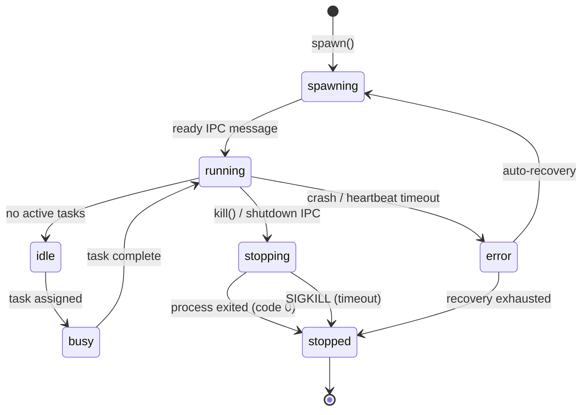

# Agent System

The agent system manages autonomous AI worker processes with lifecycle management, IPC communication, auto-recovery, and a pluggable hook system.

---

## Agent Types (14)

| Name | Category | Tools | Description |
|------|----------|-------|-------------|
| `build` | primary | all | Full-access development agent |
| `plan` | primary | read-only | Architecture and planning |
| `read` | subagent | read-only | Fast codebase exploration |
| `write` | subagent | write, edit, read | File creation and editing |
| `test` | subagent | bash (restricted), read | Run tests, analyze failures |
| `validate` | subagent | read, bash (lint) | Type checking and linting |
| `review` | subagent | read-only | Code review for security and patterns |
| `debug` | subagent | all | Systematic debugging |
| `document` | subagent | read, write | Generate and update documentation |
| `refactor` | subagent | read, write, edit | Code restructuring |
| `deploy` | subagent | bash (deploy), read | Deployment and CI/CD |
| `monitor` | subagent | bash, read | File watching and health checks |
| `explore` | subagent | read-only | Lightweight search |
| `main` | (implied) | read, web, bash | Default agent type |

## Lifecycle State Machine



## Core Components

### AgentManager

The central orchestrator for all agent processes. Located at `src/agent/manager.ts`.

```typescript
const manager = new AgentManager()

// Spawn a new agent worker
const agentId = await manager.spawn({
  name: "my-agent",
  script: "src/agent/agent-worker.ts",
  agentType: "build",
  env: { MY_VAR: "value" },
})

// Send a task
manager.sendIpc(agentId, {
  type: "run-task",
  payload: { command: "analyze this code" },
})

// Listen for events
manager.onEvent((event) => {
  console.log(event.type, event.agentId, event.data)
})

// Kill an agent
await manager.kill(agentId)

// Clean up all agents
await manager.destroy()
```

### AgentRuntime

Provides execution context for agents. Located at `src/agent/runtime.ts`.

```typescript
const runtime = createAgentRuntime("agent-1", "build")

// Build the system prompt (includes agent type instructions + memory context)
const prompt = await runtime.buildSystemPrompt()

// Execute a tool
const result = await runtime.executeTool("read", { path: "file.txt" })

// Load memory into context
const memory = await runtime.loadMemory()
```

### AgentEngine

The execution engine that connects the runtime to an AI provider. Located at `src/agent/engine.ts`.

```typescript
const runtime = createAgentRuntime("agent-1", "build")
const ai = new AIProviderManager({ provider: "anthropic", model: "claude-sonnet-4-20250514" })
const engine = new AgentEngine(runtime, ai, { maxSteps: 10 })

// Non-streaming chat
const result = await engine.chat([{ role: "user", content: "Hello" }])

// Streaming chat
const fullText = await engine.streamChat(
  [{ role: "user", content: "Write a poem" }],
  { onChunk: (chunk) => process.stdout.write(chunk) },
)
```

## IPC Protocol

Agents communicate via JSON-line protocol over stdin/stdout.

### Parent → Worker

| Message | Payload | Description |
|---------|---------|-------------|
| `{ type: "ping" }` | — | Heartbeat check |
| `{ type: "echo", payload }` | any | Connectivity test |
| `{ type: "run-task", payload }` | `{ goal: string }` | Execute a task |
| `{ type: "shutdown" }` | — | Graceful stop |

### Worker → Parent

| Message | Payload | Description |
|---------|---------|-------------|
| `{ type: "result", payload }` | varies | Command result |
| `{ type: "log", payload }` | `{ level, text }` | Structured log |
| `{ type: "heartbeat", payload }` | `{ name, taskCount }` | Periodic liveness signal |
| `{ type: "error", payload }` | `{ message }` | Error report |

## Auto-Recovery

When an agent crashes, AgentManager can automatically respawn it with exponential backoff.

```typescript
// Configure recovery (in AgentDef)
const def = {
  name: "resilient-agent",
  script: "src/agent/agent-worker.ts",
  recovery: {
    maxRetries: 5,          // Maximum restart attempts
    backoffMs: 1000,        // Initial delay (1s)
    backoffMultiplier: 2,   // Exponential factor
    backoffMax: 60000,      // Cap at 60s
  },
}
```

Recovery flow:
1. Process exits with non-zero code → `agent:error` event emitted
2. `triggerRecovery()` schedules a restart with backoff
3. On retry, `performRecovery()` spawns a new worker
4. If successful → `agent:recovered` event
5. If exhausted → `agent:maxRetries` event, agent marked as stopped

## Hook System

Lifecycle hooks for spawn, kill, message, error, and exit events.

```typescript
hooks.register("spawn", "pre", (ctx) => {
  console.log(`Spawning ${ctx.agentId}`)
  ctx.meta["custom"] = "data"  // Pass data to post-hooks
}, { priority: 100, label: "my-hook" })

hooks.register("spawn", "post", (ctx) => {
  console.log(`Spawned ${ctx.agentId}`, ctx.meta.custom)
})

hooks.unregister("my-hook")
```

### Available Hook Points

| Hook Point | Phases | Description |
|------------|--------|-------------|
| `spawn` | pre, post | Before/after agent spawn |
| `kill` | pre, post | Before/after agent kill |
| `message` | pre, post | Before/after IPC message handling |
| `error` | pre, post | Before/after error events |
| `exit` | pre, post | Before/after process exit |

## Event System

```typescript
manager.onEvent((event) => {
  switch (event.type) {
    case "agent:spawned":  // New agent started
    case "agent:ready":    // Agent sent ready signal
    case "agent:stopped":  // Agent terminated
    case "agent:error":    // Agent error
    case "agent:result":   // Agent returned a result
    case "agent:log":      // Agent log entry
    case "agent:heartbeat": // Agent heartbeat received
    case "agent:recovering": // Auto-recovery triggered
    case "agent:recovered":  // Auto-recovery succeeded
    case "agent:maxRetries": // Recovery exhausted
    case "agent:exit":       // Process exited
  }
})
```

## Agent Worker

The default worker (`src/agent/agent-worker.ts`) runs a ReAct (Reasoning + Acting) loop:

1. Receives a goal via IPC `run-task`
2. Loads available skills and context
3. Enters a Thought → Action → Observation cycle
4. Calls tools, receives results, reasons about next steps
5. Produces a final answer or error

## Agent-to-Agent Routing

Agents can communicate with each other via `routeIpc`:

```typescript
// Route a message from agent-a to agent-b
await manager.routeIpc("agent-a", "agent-b", {
  type: "run-task",
  payload: { goal: "Analyze this data" },
})
```

## CLI Commands

```bash
# List available agent types
aegis agent types

# List running agents
aegis agent list
aegis agent list --status running

# Spawn a new agent
aegis agent spawn my-agent --type build

# Kill an agent
aegis agent kill my-agent

# View agent logs
aegis agent logs my-agent
aegis agent logs my-agent --tail 20

# Inspect agent details
aegis agent inspect my-agent
```
