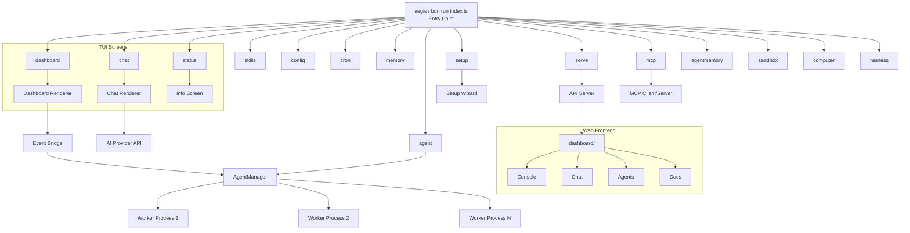

# System Architecture

High-level architecture overview of Aegis (Neuron OS).

---

## Architecture Diagram



## Module Breakdown

| Module | Path | Responsibility |
|--------|------|----------------|
| **CLI** | `src/cli/` | Command registration, banner, theme, palette. Uses Commander for argument parsing. |
| **Modes** | `src/modes/` | Mode framework (types, registry) + 15 mode screen implementations |
| **Agent** | `src/agent/` | Agent lifecycle, process management, IPC, hooks, runtime, engine, worker |
| **Dashboard TUI** | `src/tui/` | Dashboard rendering, state management, commands |
| **Chat TUI** | `src/chat/` | Chat UI, streaming, provider integration, session management |
| **Web Dashboard** | `dashboard/` | Vite + React 19 frontend with 15 route pages |
| **Wizard** | `src/wizard/` | Interactive setup flows (provider selection, key entry) |
| **Tools** | `src/tools/` | Tool registry and built-in tool implementations |
| **Skills** | `src/skills/` | Skill loading, registry, and remote API client |
| **Memory** | `src/memory/` | Session persistence, memory system, vector search, agentmemory connector |
| **AI** | `src/ai/` | AI provider management, provider factories, model configuration |
| **MCP** | `src/mcp/` | Model Context Protocol client and server |
| **API** | `src/api/` | HTTP REST API server |
| **Cron** | `src/cron/` | Cron engine for scheduled tasks |
| **Vault** | `src/vault/` | AES-256-GCM encrypted credential storage |
| **Config** | `src/config.ts` | Persistent configuration management |
| **Harness** | `src/harness/` | Agent evaluation harness for testing agent performance |

## Data Flow

```
User → aegis (no args) → Wakeup Picker → Navigation (↑↓ Enter)
                                       → Dashboard (full TUI)
                                       → Chat (full TUI)
                                       → Info Screen (status/skills/config/etc.)
                                       → Setup (interactive wizard)
                                       → Web Dashboard (dashboard/dist/)
```

### Chat Data Flow

```
User Input → Chat Store → AI Provider → Streaming Response → Chat Store → Renderer
                ↕                              ↕
          Session Store                 Memory System
          (persist/load)           (facts, daily logs, context)
```

### Agent Data Flow

```
User Command → AgentManager → Spawn Worker → IPC Protocol
                  ↕                                ↕
            Hook Registry                    AgentRuntime
                  ↕                                ↕
            Event System               Tools / Skills / Memory
                  ↕
            Dashboard (via Event Bridge)
```

## Key Design Decisions

### 1. Dependency Injection for Testability

The `AgentRuntime` class accepts an optional `MemorySystem` parameter, defaulting to the global singleton. This allows integration tests to inject a temp-directory-backed memory system for isolated, deterministic testing.

```typescript
// Production: uses singleton
const runtime = createAgentRuntime("agent-1", "build")

// Test: injects isolated memory
const memory = new MemorySystem(tempDir)
const runtime = new AgentRuntime({ agentId: "test", cwd: tempDir }, memory)
```

### 2. Process-per-Agent Isolation

Each agent runs as a separate Bun process communicating via JSON-line IPC over stdin/stdout. This provides:
- Process-level isolation (crashes don't affect other agents)
- Independent lifecycle management
- Scalable resource allocation

### 3. Provider-Agnostic AI Layer

The `AIProviderManager` abstracts over model providers via a factory registry. New providers can be added by registering a factory function:

```typescript
registerProvider("my-provider", (config) => createOpenAI({ ... })(config.model))
```

### 4. Mock AI for Integration Testing

The AI layer supports mocking for integration tests without real API keys:

```typescript
const mockAi = createMockAI("Predefined response text")
const engine = new AgentEngine(runtime, mockAi)
const result = await engine.chat([{ role: "user", content: "Hello" }])
// result.text === "Predefined response text"
```

## TypeScript Configuration

The project uses strict TypeScript:

| Setting | Value |
|---------|-------|
| `strict` | `true` |
| `noUnusedLocals` | `true` |
| `noUnusedParameters` | `true` |
| `exactOptionalPropertyTypes` | `false` |
| Target | `ESNext` |
| Module | `ESNext` |

## File Organization

```
src/
├── modes/         # Mode framework (15 TUI modes)
├── agent/         # Agent lifecycle, engine, runtime
├── chat/          # Chat TUI components, store, provider
├── cli/           # CLI commands, theme, banner
├── tui/           # Dashboard TUI components, store, renderer
├── ai/            # AI provider abstraction (provider, models, factories)
├── tools/         # Tool registry and 10 built-in tools
├── skills/        # Skill system (registry, remote client)
├── memory/        # Memory system, vector search, sessions
├── mcp/           # MCP client and server
├── api/           # HTTP REST API server
├── cron/          # Cron engine
├── vault/         # AES-256-GCM credential encryption
├── sandbox/       # Execution sandbox (filesystem, process, Docker)
├── harness/       # Agent evaluation harness
├── wizard/        # Interactive setup flows
└── adapters/      # External platform adapters (Telegram, etc.)
```
