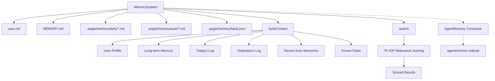

# Memory System

Aegis provides a persistent memory system for storing and retrieving information across sessions.

---

## Overview

The memory system is built around `MemorySystem` (`src/memory/system.ts`), which provides:

- **Long-term memory** — Persistent markdown file (`MEMORY.md`) for durable knowledge
- **Daily logs** — Per-day markdown files for time-based activity tracking
- **Auto memories** — Individual markdown files for automatically captured insights
- **Fact extraction** — Regex-based pattern matching to extract structured facts from conversations
- **User profile** — Editable `user.md` file for identity, preferences, and constraints
- **Semantic search** — TF-IDF relevance scoring across all memory sources
- **AgentMemory integration** — Optional sidecar connector for hybrid BM25+Vector+Graph search

## Architecture



## Data Storage

### File Layout

```
project-root/
├── user.md                    # User profile (identity, preferences, constraints)
├── MEMORY.md                  # Long-term durable memory
└── .aegis/memory/
    ├── daily/                 # Per-day activity logs
    │   ├── 2026-01-15.md
    │   └── 2026-01-16.md
    ├── auto/                  # Auto-captured insights
    │   ├── 1736908800000.md
    │   └── 1736908800001-bug.md
    └── facts.json             # Extracted structured facts
```

### Storage Structure

Each memory file uses simple markdown format:

**`MEMORY.md`:**
```markdown
# Aegis Memory

Long-term durable facts and knowledge.

## 2026-01-15T10:30:00.000Z

The authentication service uses JWT tokens with 24h expiry.

## 2026-01-15T11:00:00.000Z

Database connection pooling is configured with a max of 20 connections.
```

**Daily log (`2026-01-15.md`):**
```markdown
# Daily Log - 2026-01-15

## 10:30:00

Worked on authentication module refactoring.

## 14:00:00

Implemented rate limiting middleware.
```

**Auto memory (`1736908800000.md`):**
```markdown
# Auto Memory

**Timestamp:** 2026-01-15T10:30:00.000Z
**Tag:** bug

Key insight about the race condition in concurrent request handling.
```

## API Reference

### Initialization

```typescript
import { MemorySystem } from "./memory/system"

// Create with project directory
const memory = new MemorySystem("/path/to/project")

// Initialize directories and default files
await memory.initialize()
```

### Reading & Writing Memory

```typescript
// Append to long-term memory
await memory.appendToMemory("Important fact about the system")

// Load all memory content
const content = await memory.loadMemory()
```

### User Profile

```typescript
// Update user preferences
await memory.updateUserProfile({
  name: "Alice",
  preferences: ["Use TypeScript", "Write tests"],
  neverDo: ["Delete production data"],
})

// Read the profile
const profile = await memory.loadUserProfile()
```

### Daily Logs

```typescript
// Log activity for today
await memory.appendToDailyLog("Implemented feature X")

// Log activity for a specific date
await memory.appendToDailyLog("Deployed to staging", new Date("2026-01-15"))

// Read a specific day's log
const log = await memory.loadDailyLog(new Date("2026-01-15"))
```

### Auto Memories

```typescript
// Save an auto-captured insight
await memory.saveAutoMemory("Discovered pattern for handling backpressure", "performance")

// Load recent auto memories
const recent = await memory.loadAutoMemories(10)
```

### Fact Extraction

```typescript
// Extract facts from conversation
const facts = await memory.extractAndStoreFacts(
  "my name is Alice. I prefer TypeScript. the project is Neuron OS."
)
// Returns: [
//   { fact: "Alice", category: "identity", confidence: 0.9, ... },
//   { fact: "TypeScript", category: "preference", confidence: 0.8, ... },
//   { fact: "Neuron OS", category: "project", confidence: 0.7, ... },
// ]

// Query facts by category
const identity = await memory.getFactsByCategory("identity")

// Get all facts
const all = await memory.getAllFacts()
```

### Context Building

```typescript
// Build full context string for the system prompt
const context = await memory.buildContext({
  agentId: "agent-1",
  cwd: "/path/to/project",
})
// Returns: Markdown string with sections for:
//   - User Profile
//   - Long-term Memory
//   - Today's Log
//   - Yesterday's Log
//   - Recent Auto Memories
//   - Known Facts
```

### Search

```typescript
// Semantic search across all memory sources
const results = await memory.search("database connection pooling", 10)
// Returns: MemoryEntry[] with relevance scoring
// Each entry has: content, timestamp, source (memory|daily|auto|user)
```

## Fact Extraction Patterns

The system uses regex patterns to extract structured facts from natural language:

| Pattern | Category | Confidence |
|---------|----------|------------|
| `I am \| my name is \| call me <name>` | identity | 0.9 |
| `I prefer \| I like \| I enjoy <thing>` | preference | 0.8 |
| `the project is \| this project <description>` | project | 0.7 |
| `we decided \| agreed to <decision>` | decision | 0.8 |
| `never \| don't \| avoid <action>` | preference | 0.5 |
| `always \| remember to <action>` | workflow | 0.6 |
| `reports to \| manages <person>` | relationship | 0.7 |

Facts with confidence ≥ 0.7 appear in `buildContext()` output.

## Search Algorithm

The search uses TF-IDF relevance scoring:

1. **Term frequency**: `log(1 + matches) / log(1 + docLength)`
2. **Header bonus**: +0.3 if term appears in a markdown header
3. **Daily log decay**: Recent logs weighted higher (1 - daysAgo * 0.065)
4. **Multi-source fusion**: Results from memory, daily logs, auto memories, user profile, and facts

## Dependency Injection

The `MemorySystem` can be injected into `AgentRuntime` for testing:

```typescript
// Production: uses global singleton
const runtime = createAgentRuntime("agent-1", "build")

// Test: injects isolated memory
const memory = new MemorySystem(tempDir)
await memory.initialize()
await memory.appendToMemory("Test data")
const runtime = new AgentRuntime(
  { agentId: "test", agentType: "build", cwd: tempDir },
  memory,
)
const prompt = await runtime.buildSystemPrompt()
// prompt includes "Test data" from the injected memory
```

## AgentMemory Sidecar (Optional)

The AgentMemory sidecar provides enhanced search with hybrid BM25+Vector+Graph retrieval.

```bash
# Start the sidecar
# (requires separate agentmemory service)

# Check connection
aegis agentmemory status

# Hybrid search
aegis agentmemory search "database performance"
```

Configuration via environment variables:

| Variable | Default | Description |
|----------|---------|-------------|
| `AGENTMEMORY_URL` | `http://localhost:3111` | Sidecar endpoint |
| `AGENTMEMORY_SECRET` | — | Bearer token for auth |
| `AGENTMEMORY_ENABLED` | `true` | Set to `false` to disable |

## Performance

Benchmark results (100 memories, 30 daily logs, 200 auto memories, 500 facts):

| Operation | Mean Time |
|-----------|-----------|
| Empty buildContext | 3.2ms |
| 100 memories buildContext | 1.2ms |
| +30 daily logs buildContext | 1.5ms |
| +200 auto mems buildContext | 4.7ms |
| +500 facts buildContext | 32.8ms |
| Search (specific) | 138ms |
| Search (broad) | 174ms |

Scaling factor from empty to full dataset: ~10x
