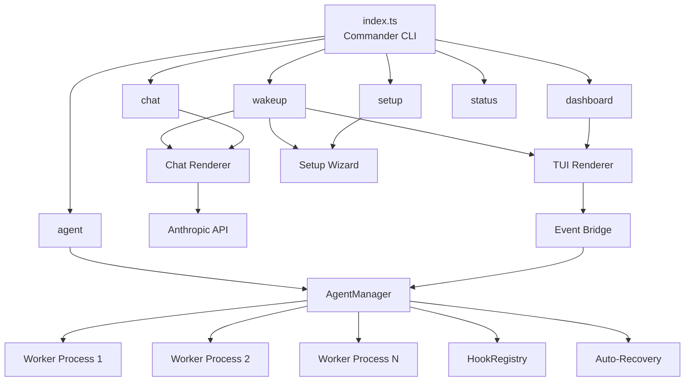
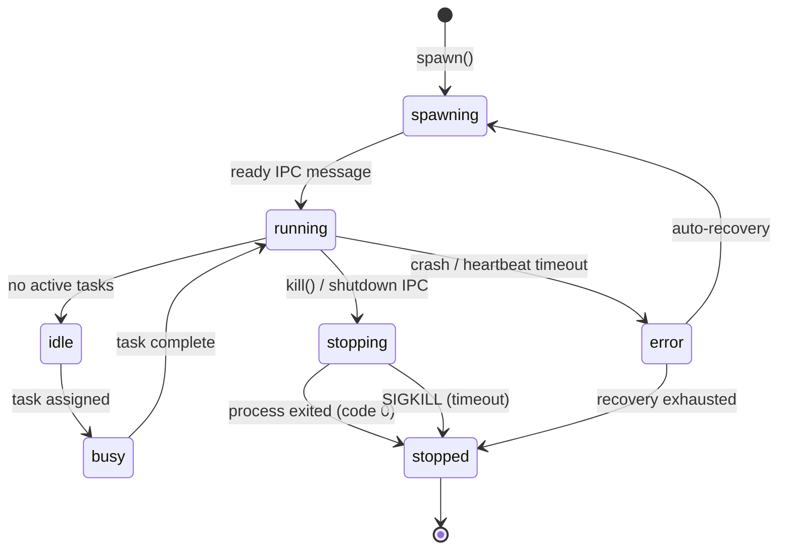

# Comprehensive README Design Spec

**Date:** 2026-05-30
**Project:** Aegis (neuron-os)
**Scope:** Single comprehensive README.md at repository root

## Overview

Replace the boilerplate `bun init` README with a comprehensive, production-quality README that serves both end users (how to install/run/use) and developers (architecture, internals, contributing).

## Target Audience

- **End users:** Developers who will install and use Aegis CLI to manage AI agents
- **Contributors:** Developers who will modify the Aegis codebase

## README Sections

### 1. Hero

- ASCII art banner (generated from figlet "AEGIS" in "Big" font)
- Tagline: "The Operating System for Autonomous AI Agents"
- Badges: version, Bun version, TypeScript, license

### 2. Features

Bullet list of key capabilities:
- 13 specialized agent types (build, plan, read, write, test, validate, review, debug, document, refactor, deploy, monitor, explore)
- Live TUI dashboard with real-time agent monitoring
- AI-powered chat interface with Anthropic streaming
- Auto-recovery with exponential backoff
- Lifecycle hook system (pre/post spawn, kill, message, error, exit)
- JSON-line IPC protocol for agent communication
- Interactive setup wizard
- Multi-provider support (Anthropic, OpenAI, Ollama, DeepSeek, custom)

### 3. Quick Start

- Prerequisites: Bun >= 1.3.14
- 3-command install: clone, `bun install`, `bun run index.ts wakeup`
- Global install via `bun link`

### 4. Commands

Full reference for all 6 commands with aliases, flags, and examples:

| Command | Alias | Description |
|---------|-------|-------------|
| `wakeup` | `w` | Interactive mode launcher |
| `dashboard` | `dash` | Live TUI dashboard |
| `chat` | `c` | AI chat interface |
| `agent` | `a` | Agent management (subcommands: types, list, spawn, kill, logs, inspect) |
| `setup` | - | Configuration wizard |
| `status` | `st` | System status overview |

Each command gets:
- Usage syntax
- Available flags/options
- Example invocations
- Expected output description

### 5. Architecture

#### System Diagram (Mermaid)

High-level flow: CLI entry (Commander) → Command handlers → Subsystems (Agent Manager, TUI Renderer, Chat Renderer, Wizard Flows)

#### Module Breakdown Table

| Module | Path | Responsibility |
|--------|------|----------------|
| CLI | `src/cli/` | Command registration, banner, theme, palette |
| Agent | `src/agent/` | Agent lifecycle, process management, IPC, hooks |
| TUI | `src/tui/` | Dashboard rendering, state management |
| Chat | `src/chat/` | Chat UI, Anthropic streaming, message state |
| Wizard | `src/wizard/` | Interactive setup flows |

#### Data Flow Diagram (Mermaid)

User input → CLI command → Subsystem → Agent Manager → Worker processes (JSON-line IPC over stdin/stdout)

### 6. Agent System

#### Agent Types Table

All 13 types with columns: Name, Mode (primary/subagent), Tools, Model Hint, Description

#### Lifecycle State Machine (Mermaid)

States: spawning → running → idle → busy → stopping → stopped → error
Transitions with triggers

#### IPC Protocol

JSON-line format over stdin/stdout:
- Parent → Worker: ping, echo, run-task, shutdown
- Worker → Parent: result, log, heartbeat, error

#### Auto-Recovery

- Exponential backoff: base * multiplier^attempt, capped at max
- Default: 5 retries, 1s base, 2x multiplier, 60s cap
- Recovery state tracking per agent

#### Hook System

- Hook points: spawn, kill, message, error, exit
- Phases: pre, post
- Priority-ordered execution
- Mutable metadata context

### 7. Security Model

- Tool permissions per agent type (read, write, edit, bash, grep, glob, web_fetch, web_search)
- Pattern-restricted bash access for test/validate/deploy agents
- System access warnings for privileged operations
- Agent operates with user's filesystem permissions

### 8. Chat Provider Setup

- ANTHROPIC_API_KEY environment variable
- Setup wizard provider selection (Anthropic, OpenAI, Ollama, DeepSeek, custom)
- .env file configuration
- Model configuration (default: claude-sonnet-4-20250514)

### 9. Project Structure

Annotated directory tree:
```
neuron-os/
├── index.ts              # CLI entry point
├── src/
│   ├── agent/            # Agent system core
│   │   ├── agent-types.ts  # 13 agent type definitions
│   │   ├── agent-worker.ts # Default worker process
│   │   ├── hooks.ts        # Lifecycle hook registry
│   │   ├── manager.ts      # AgentManager (spawn/kill/IPC)
│   │   └── types.ts        # Core type definitions
│   ├── chat/             # Chat TUI
│   │   ├── components/     # Header, messages, input area
│   │   ├── provider.ts     # Anthropic API streaming
│   │   ├── renderer.ts     # Terminal rendering loop
│   │   └── store.ts        # Chat state management
│   ├── cli/              # CLI framework
│   │   ├── commands/       # All command handlers
│   │   ├── banner.ts       # Figlet ASCII banner
│   │   ├── guard.ts        # Input validation
│   │   ├── palette.ts      # Color palette
│   │   └── theme.ts        # Themed output helpers
│   ├── tui/              # Dashboard TUI
│   │   ├── components/     # Header, agent list, log, command bar, status
│   │   ├── renderer.ts     # Terminal rendering loop
│   │   └── store.ts        # Dashboard state + agent event bridge
│   └── wizard/           # Setup wizards
│       ├── flows/          # Setup flow
│       ├── clack-prompter.ts # @clack/prompts adapter
│       └── types.ts        # Wizard interface types
├── agent-tui-ref/        # Reference Turborepo project
├── docs/                 # Documentation
└── package.json
```

### 10. API Reference

#### AgentManager

| Method | Signature | Description |
|--------|-----------|-------------|
| `spawn` | `(def: AgentDef) => Promise<string>` | Spawn a new agent worker, returns agent ID |
| `kill` | `(id: string, timeoutMs?: number) => Promise<void>` | Graceful stop then SIGKILL |
| `sendIpc` | `(id: string, msg: AgentIpcMessage) => void` | Send JSON-line IPC message |
| `ping` | `(id: string) => void` | Send heartbeat ping |
| `get` | `(id: string) => AgentInstance \| undefined` | Get agent by ID |
| `list` | `(filter?) => AgentInstance[]` | List agents with optional filter |
| `getLogs` | `(id: string, opts?) => AgentLogEntry[]` | Get agent log entries |
| `onEvent` | `(cb: (event: AgentEvent) => void) => void` | Register event listener |
| `offEvent` | `(cb: (event: AgentEvent) => void) => void` | Remove event listener |
| `destroy` | `() => Promise<void>` | Kill all agents, clean up |

#### HookRegistry

| Method | Signature | Description |
|--------|-----------|-------------|
| `register` | `(point, phase, fn, opts?) => this` | Register a lifecycle hook |
| `unregister` | `(label: string) => this` | Remove hooks by label |
| `run` | `(point, phase, agentId, instance, data?) => Promise<Record>` | Execute hooks |
| `clear` | `() => void` | Remove all hooks |

#### Key Types

- `AgentDef` — Agent definition (name, script, agentType, tools, env, args, limits, tags, recovery)
- `AgentInstance` — Runtime agent state (id, def, status, process, pid, log, metadata)
- `AgentEvent` — Events emitted by AgentManager (type, agentId, data)
- `AgentIpcMessage` — IPC message format (type, id, payload, timestamp)

### 11. Development

- Running in dev mode: `bun run index.ts <command>`
- Adding a new command: create file in `src/cli/commands/`, register in `index.ts`
- Adding a new agent type: add to `AGENT_TYPES` in `agent-types.ts`
- Adding TUI components: create in `src/tui/components/` or `src/chat/components/`
- Code conventions: TypeScript strict mode, Bun runtime, no comments unless asked

### 12. Deployment

- Bundle: `bun build index.ts --target=bun --outfile=dist/aegis`
- Standalone binary: `bun build index.ts --compile --outfile=aegis`
- npm/bun publish via `bin` field in package.json
- Global install: `bun link` in project root

### 13. Configuration

Environment variables table:

| Variable | Required | Description |
|----------|----------|-------------|
| `ANTHROPIC_API_KEY` | For chat | Anthropic API key |
| `AEGIS_AGENT_ID` | Auto-set | Agent instance ID |
| `AEGIS_AGENT_NAME` | Auto-set | Agent display name |
| `AEGIS_AGENT_TYPE` | Auto-set | Agent type name |
| `AEGIS_SYSTEM_PROMPT` | Auto-set | System prompt for agent |
| `AEGIS_MODEL_HINT` | Optional | Model preference |
| `AEGIS_MAX_TURNS` | Optional | Max conversation turns |
| `AEGIS_TEMPERATURE` | Optional | Model temperature |

### 14. Troubleshooting / FAQ

- Agent "did not become ready within 10000ms" — worker script not sending ready message
- Heartbeat timeout — agent process hung or unresponsive
- No ANTHROPIC_API_KEY — set environment variable
- Agent recovery exhausted — check worker script for crash loops
- Force kill: `aegis agent kill <name> --force`

### 15. Tech Stack

| Technology | Purpose |
|-----------|---------|
| Bun | Runtime, package manager, bundler, process spawning |
| TypeScript | Type safety (strict mode, ESNext target) |
| Commander | CLI framework |
| @clack/prompts | Interactive wizard UI |
| picocolors | Terminal colors |
| figlet | ASCII art banner |
| ansi-escapes | Terminal escape sequences |
| cli-truncate | Terminal line truncation |

### 16. Roadmap

Current: v0.1.0 (initial TUI platform)

Planned:
- Shell mode (interactive REPL)
- Multi-provider chat (OpenAI, Ollama, DeepSeek)
- Persistent agent storage and session management
- Web-based dashboard
- Agent-to-agent communication
- Plugin system for custom agent types
- Remote agent orchestration

## Mermaid Diagrams

### System Architecture


### Agent Lifecycle


## Implementation Notes

- Single file: `README.md` at repository root
- Overwrite existing boilerplate README
- Use GitHub-flavored Markdown
- Mermaid diagrams render natively on GitHub
- Target length: ~500-600 lines
- No emojis (per project conventions)
