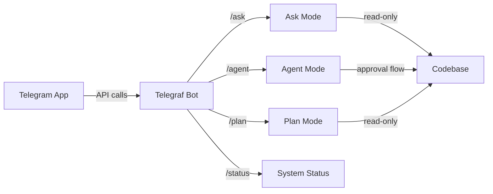

# Telegram Bot Integration

Aegis includes a built-in Telegram bot adapter that lets you interact with your codebase through Telegram. You can ask questions, generate plans, and run AI agents — all from your phone.

---

## How It Works



The bot runs on your machine and connects to Telegram's servers using the token you get from [@BotFather](https://t.me/botfather). All AI processing happens locally — your code never leaves your machine.

---

## Setup

### 1. Create a Bot via BotFather

1. Open Telegram and search for **[@BotFather](https://t.me/botfather)**
2. Send `/newbot` and follow the prompts:
   - Choose a **name** for your bot (e.g., `My Dev Bot`)
   - Choose a **username** (must end in `bot`, e.g., `my_dev_bot`)
3. BotFather will reply with an **HTTP API token**:
   ```
   1234567890:ABCdefGHIjklMNOpqrsTUVwxyz
   ```
4. (Optional) Send `/setprivacy` to **Disabled** so the bot can see all messages in a group

### 2. Configure the Token

**Option A: Using the setup wizard (recommended)**

```bash
aegis setup-keys
```

The wizard will guide you through:
- Configuring AI providers: **Anthropic**, **OpenAI**, **DeepSeek**, **Gemini**, **Groq**, **OpenRouter**, **Ollama**
- Pasting your Telegram bot token
- (Optional) Restricting access to specific Telegram user IDs

**Option B: Set manually**

```bash
aegis config set TELEGRAM_BOT_TOKEN 1234567890:ABCdefGHIjklMNOpqrsTUVwxyz
```

**Option C: Pass as CLI argument**

```bash
aegis telegram --token 1234567890:ABCdefGHIjklMNOpqrsTUVwxyz
```

### 3. Start the Bot

```bash
aegis telegram
```

You should see:
```
  ✓ Telegram bot is running
  Press Ctrl+C to stop
```

### 4. Test It

Open Telegram, find your bot, and send `/start`. You'll see a welcome message with available commands.

---

## Available Commands

| Command | Description | Example |
|---------|-------------|---------|
| `/start` | Welcome message with available commands | `/start` |
| `/help` | Detailed help for all commands | `/help` |
| `/search <query>` | Multi-source search: codebase + memory + web (no AI key needed) | `/search memory agent` or `/search web AI news` |
| `/ask <question>` | Read-only AI research — asks about your codebase | `/ask How does the agent system work?` |
| `/agent <goal>` | AI agent mode — modifies code with approval | `/agent Add a health check endpoint` |
| `/plan <goal>` | Generate a step-by-step implementation plan | `/plan Add user authentication` |
| `/status` | Check agent system status | `/status` |

### /ask — Research Mode

Ask questions about your codebase. The agent explores your code using read-only tools and returns a detailed answer with file references.

```
/ask How is the memory system structured?
```

The agent will:
1. Search the codebase for memory-related files
2. Read relevant files
3. Return a comprehensive answer with file paths and line numbers

### /agent — AI Agent Mode

Let the AI modify your codebase with an approval flow:

```
/agent Add a health check endpoint to the API server
```

The agent will:
1. Explore the codebase to understand the existing structure
2. Plan the changes needed
3. **Stage all changes** and send you a summary
4. Wait for your approval via inline buttons:
   - **📋 Show Diff** — See the detailed changes
   - **✅ Accept All** — Apply the changes
   - **❌ Reject All** — Discard the changes

### /plan — Planning Mode

Generate a detailed, step-by-step implementation plan without making any changes:

```
/plan Add database migration support
```

The agent will explore the codebase and return a structured plan covering:
- Files to modify (with specific sections)
- Files to create
- Implementation steps
- Testing strategy

### /status — System Status

Quick check on the agent system:

```
/status
```

Returns:
- Running agent count
- Total agent count
- Individual agent status (for up to 10 agents)

---

## Security

### User Restriction

You can restrict the bot to only respond to specific Telegram user IDs:

```bash
aegis config set TELEGRAM_ALLOWED_USERS "123456789, 987654321"
```

Or during setup via `aegis setup-keys`. Unauthorized users will see:

```
⛔ Unauthorized. Your user ID is not allowed to use this bot.
```

### Approval Flow

The `/agent` command uses an **approval flow** — all file modifications are staged first and must be explicitly approved via inline keyboard buttons. The bot never modifies files without your explicit consent.

### Local Processing

All AI processing happens on your machine using locally configured AI providers (Anthropic, OpenAI, etc.). Your code and data never leave your control.

---

## Running 24/7 (Cloud Deployment)

To run the Telegram bot 24/7 without keeping your laptop open, deploy it to a cloud server. Here are several options:

### Option 1: VPS (DigitalOcean, Linode, Hetzner)

Best for: Full control, any scale ($5–10/mo)

1. Create a cheap Linux VPS (Ubuntu 22.04, 1GB RAM is plenty)
2. SSH in and install Bun:

```bash
curl -fsSL https://bun.sh/install | bash
```

3. Clone your repo and install:

```bash
git clone https://github.com/your-username/neuron-os.git
cd neuron-os
bun install
```

4. Set up credentials:

```bash
aegis config set TELEGRAM_BOT_TOKEN "YOUR_BOT_TOKEN"
aegis config set ANTHROPIC_API_KEY "sk-ant-..."
```

5. Create a systemd service so it auto-restarts on crash or reboot:

```bash
sudo tee /etc/systemd/system/aegis-telegram.service << 'EOF'
[Unit]
Description=Aegis Telegram Bot
After=network.target

[Service]
Type=simple
User=$(whoami)
WorkingDirectory=$(pwd)
ExecStart=$(which aegis) telegram
# Or via bun: ExecStart=$(which bun) run index.ts telegram
Restart=always
RestartSec=10

[Install]
WantedBy=multi-user.target
EOF

sudo systemctl daemon-reload
sudo systemctl enable aegis-telegram
sudo systemctl start aegis-telegram
sudo systemctl status aegis-telegram   # Verify it's running
```

### Option 2: Docker on any Cloud (Railway, Fly.io, Render)

Best for: Quick deployment, no server management

Build and push the Docker image, then deploy:

```bash
# Build the image
docker build -t aegis-telegram:latest .

# Tag and push to Docker Hub or your registry
docker tag aegis-telegram:latest username/aegis-telegram:latest
docker push username/aegis-telegram:latest
```

**Fly.io example** (free tier available):

```bash
# Install flyctl and launch
fly launch --image username/aegis-telegram:latest
fly secrets set TELEGRAM_BOT_TOKEN="YOUR_BOT_TOKEN"
fly secrets set ANTHROPIC_API_KEY="sk-ant-..."
fly deploy
```

**Railway example:**

```bash
# Connect your GitHub repo to Railway
# Set environment variables in Railway dashboard:
#   TELEGRAM_BOT_TOKEN
#   ANTHROPIC_API_KEY (if using /ask)
#   Set start command: aegis telegram (or: bun run index.ts telegram)
```

### Option 3: Process Manager (PM2) on any VPS

Best for: Simple process monitoring with auto-restart

```bash
# Install PM2
npm install -g pm2

# Start the bot
pm2 start bun --name aegis-telegram -- run index.ts telegram
# Or if aegis is globally installed: pm2 start aegis --name aegis-telegram -- telegram

# Save the process list so it restarts on reboot
pm2 save
pm2 startup   # Follow the instructions to enable startup

# Monitor
pm2 monit
pm2 logs aegis-telegram
```

### Option 4: GitHub Actions + Self-Hosted Runner

Best for: Free 24/7 if you have an always-on machine at home

Set up a GitHub Actions self-hosted runner on a Raspberry Pi or old laptop, then create `.github/workflows/bot.yml`:

```yaml
name: Telegram Bot
on:
  workflow_dispatch:  # Manual trigger
  schedule:
    - cron: '*/5 * * * *'  # Keep-alive ping every 5 min

jobs:
  run:
    runs-on: [self-hosted]
    steps:
      - uses: actions/checkout@v4
      - uses: oven-sh/setup-bun@v2
      - run: bun install
      - run: aegis telegram
        # or: bun run index.ts telegram
        env:
          TELEGRAM_BOT_TOKEN: ${{ secrets.TELEGRAM_BOT_TOKEN }}
```

### Parallel Processing & Multi-User Support

The Telegram bot handles **multiple users simultaneously** — Telegraf's async architecture means:
- Each user's `/ask`, `/agent`, etc. runs in its own async context
- Multiple /agent sessions can be active at the same time
- The approval callback system uses per-message ID tracking (not per-user), so multiple approval flows don't interfere
- Long-running operations (codebase search, agent tasks) don't block other users

For higher throughput, you can run **multiple bot instances** behind a load balancer, or scale vertically by giving the VPS more RAM/CPU.

### Security for Cloud Deployments

When deploying to the cloud:

1. **Use environment variables** instead of the vault file for simplicity
2. **Set TELEGRAM_ALLOWED_USERS** to restrict who can talk to the bot
3. **Never commit secrets** — use `fly secrets set`, Railway env vars, or GitHub Secrets
4. **Use a firewall** — only allow SSH and port 8080 (if exposing the API)
5. **Regular updates** — `bun update` to keep dependencies patched

---

## Troubleshooting

| Problem | Solution |
|---------|----------|
| Bot doesn't respond | Check the bot is running (`aegis telegram`), verify the token is correct |
| "Unauthorized" message | Set `TELEGRAM_ALLOWED_USERS` to include your Telegram user ID |
| `/agent` approval buttons don't work | Inline keyboards expire after a few minutes — restart the command |
| Bot works locally but not in groups | Send `/setprivacy` to BotFather and set to **Disabled** |
| "bot token not found" | Run `aegis config set TELEGRAM_BOT_TOKEN <token>` first |
| Token expired or revoked | Create a new token with BotFather's `/revoke` command |

### Finding Your User ID

To find your Telegram user ID for the `TELEGRAM_ALLOWED_USERS` setting:

1. Open Telegram and search for **[@userinfobot](https://t.me/userinfobot)**
2. Send `/start` — the bot will reply with your user ID
3. Add that ID to your allowed users list

---

## Architecture

The Telegram integration is built on three layers:

```
┌─────────────────────────────────────┐
│         PlatformAdapter             │  ← Common interface for all channels
│  (src/adapters/types.ts)            │
├─────────────────────────────────────┤
│         Telegram Adapter            │  ← Telegraf-based bot implementation
│  (src/adapters/telegram.ts)         │
│  - Command handlers (/ask, /agent)  │
│  - Inline keyboard approval flow    │
│  - Auth middleware                  │
├─────────────────────────────────────┤
│         Mode Orchestrators          │  ← AI-powered task execution
│  - src/modes/ask.ts                 │
│  - src/modes/agent-run.ts           │
│  - src/modes/plan.ts                │
└─────────────────────────────────────┘
```

### Key Files

| File | Purpose |
|------|---------|
| `src/adapters/types.ts` | `PlatformAdapter` interface definition |
| `src/adapters/telegram.ts` | Full Telegram adapter with telegraf |
| `src/adapters/index.ts` | Exports for the adapters module |
| `src/cli/commands/telegram.ts` | CLI command to start the bot |
| `src/cli/commands/setup-keys.ts` | Setup wizard with Telegram configuration |
